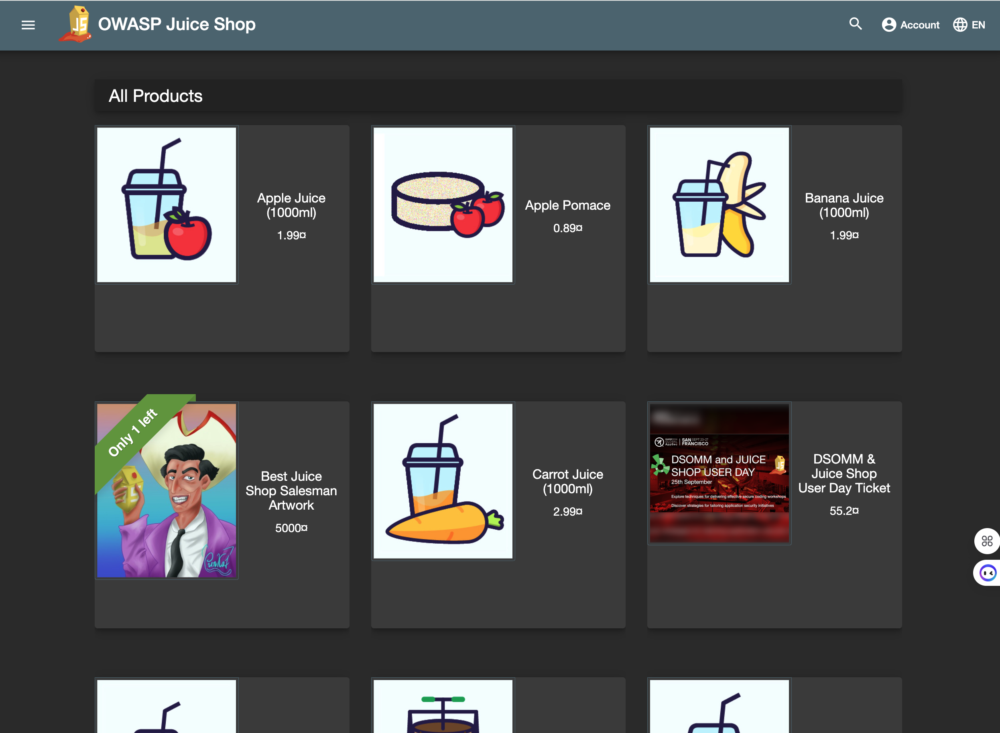
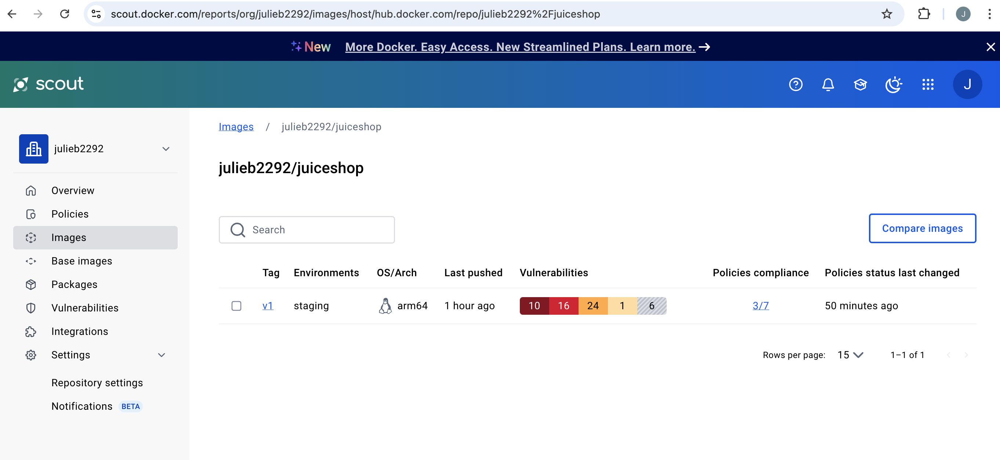

# OWASP Juice Shop Demo Set up

This project uses Docker Scout to perform software composition analysis (SCA) on the containerized Juice Shop application.

To experience Docker Scout, you will need a  [Docker account](https://app.docker.com/signup).  A free personal account can be used to run Docker Scout for one image.  

Once you have an account, [create an organization](https://hub.docker.com/orgs) to use to store your Docker images.

To run the containerized juice shop web application locally, you will need to install [Docker](https://www.docker.com/products/docker-desktop/).  If you install Docker Desktop, then Docker Scout will be automatically installed.  If you are using Docker Engine without Docker Desktop, follow the [instructions here](https://docs.docker.com/scout/install/) to install the Docker Scout binary.

Once you have installed Docker, perform the following steps in a terminal window:

1. Clone this repository

`git clone https://github.com/julieabyrne-devsecops/juice-shop.git`

2. Navigate to the repository root directory

`cd juice-shop`

3. Build the Docker image and push it to your DockerHub orgaanization (note: you must be logged into Docker to perform this operation)

`docker build --push -t <ORG_NAME>/juiceshop:v1 .`

4. To run the web application locally, run the command: 

`docker run --rm -p 127.0.0.1:3000:3000 <ORG_NAME>/juiceshop:v1`

The homepage will then be available at <http://localhost:3000>

5. You can run Docker Scout on the local image by running the command:

`docker scout quickview`

That will provide a summary of the vulnerabilities found and prompt you with additional commands to run as next steps.  Full details can also be viewed from the [Docker Scout web interface](https://scout.docker.com/).

