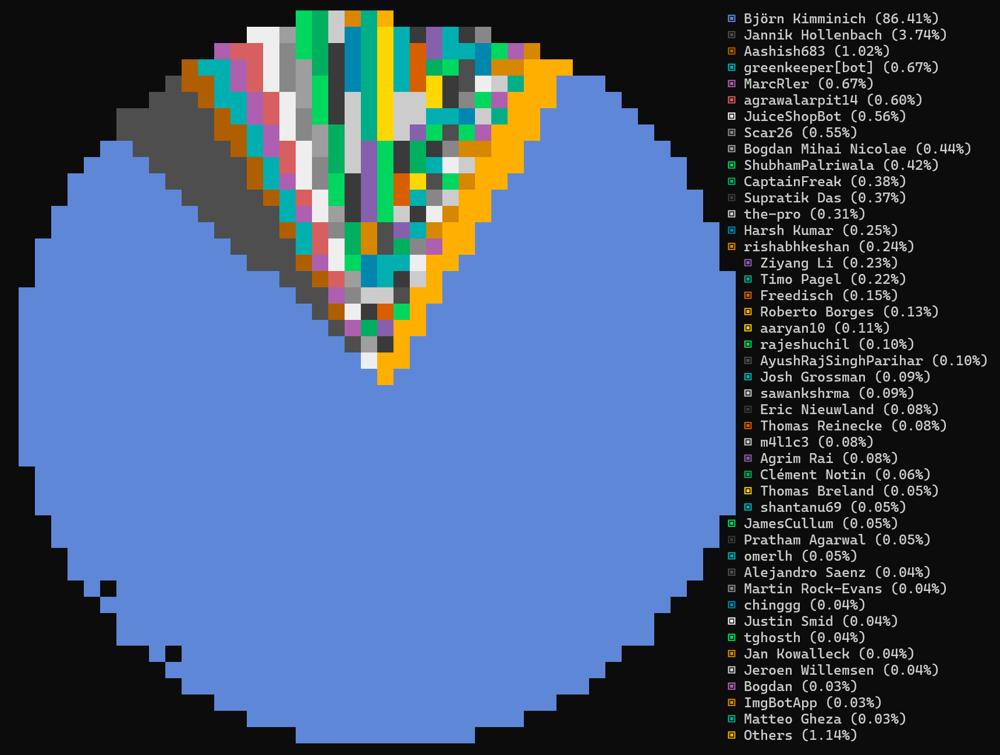

# Hall of Fame

## Core Team

- [Björn Kimminich](https://github.com/bkimminich) aka `bkimminich`
  ([Project Leader](https://www.owasp.org/index.php/Projects/Project_Leader_Responsibilities))
  
- [Jannik Hollenbach](https://github.com/J12934) aka `J12934`
- [Timo Pagel](https://github.com/wurstbrot) aka `wurstbrot`
- [Shubham Palriwala](https://github.com/ShubhamPalriwala) aka `ShubhamPalriwala`

## GitHub Contributors

As reported by [`git-stats -a -s '2014'`](https://www.npmjs.com/package/git-stats) analysis of `master` as of Fri, 08 Sep
2023 after deduplication with `.mailmap`.

## Translators

As exported from
[CrowdIn Top Members Report](https://crowdin.com/project/owasp-juice-shop/reports/top-members)
(by # of translated words) for all languages as of Tue, 14 Feb 2023 after
[conversion into Markdown](https://thisdavej.com/copy-table-in-excel-and-paste-as-a-markdown-table/).

| Name                               | Languages                                                                                                                                                                                                                                                                                                                                                                                                                                                                               | Translated |
|------------------------------------|-----------------------------------------------------------------------------------------------------------------------------------------------------------------------------------------------------------------------------------------------------------------------------------------------------------------------------------------------------------------------------------------------------------------------------------------------------------------------------------------|------------|
| Björn Kimminich (bkimminich)       | German; German, Switzerland; Chinese Simplified; Romanian; Danish; Spanish; Dutch; French; Chinese Traditional; Hebrew; Japanese; Russian; Estonian; Portuguese, Brazilian; Portuguese; Arabic; Norwegian; Czech; Hindi; Swedish; Azerbaijani; Turkish; Finnish; Polish; Indonesian; Italian; Chinese Traditional, Hong Kong; Thai; Korean; Burmese; Greek; Bulgarian; Georgian; Klingon; Latvian; Hungarian; Catalan; Lithuanian; Irish; Urdu (Pakistan); Armenian; Ukrainian; Sinhala | 34356      |
| tongsonghua (yolylight)            | Chinese Simplified                                                                                                                                                                                                                                                                                                                                                                                                                                                                      | 9658       |
| Derek Chan (ChanDerek)             | Chinese Traditional                                                                                                                                                                                                                                                                                                                                                                                                                                                                     | 5411       |
| DenisCherean                       | Romanian                                                                                                                                                                                                                                                                                                                                                                                                                                                                                | 5009       |
| Yannick (yannickboy15)             | Dutch                                                                                                                                                                                                                                                                                                                                                                                                                                                                                   | 3872       |
| NCAA                               | Danish                                                                                                                                                                                                                                                                                                                                                                                                                                                                                  | 3855       |
| Enrique Rossel (erossel)           | Spanish                                                                                                                                                                                                                                                                                                                                                                                                                                                                                 | 3416       |
| Simon Basset (simbas)              | French                                                                                                                                                                                                                                                                                                                                                                                                                                                                                  | 2933       |
| MortenHC                           | Danish                                                                                                                                                                                                                                                                                                                                                                                                                                                                                  | 2597       |
| janesmae                           | Estonian                                                                                                                                                                                                                                                                                                                                                                                                                                                                                | 2594       |
| toshiaizawa                        | Japanese                                                                                                                                                                                                                                                                                                                                                                                                                                                                                | 2302       |
| schattenbaum                       | German, Switzerland; German                                                                                                                                                                                                                                                                                                                                                                                                                                                             | 2181       |
| Jean Novak (jeannovak)             | Portuguese, Brazilian                                                                                                                                                                                                                                                                                                                                                                                                                                                                   | 2151       |
| ShahinF27 (Khan27)                 | Azerbaijani                                                                                                                                                                                                                                                                                                                                                                                                                                                                             | 2125       |
| Lang Mediator (lang.mediator)      | Russian                                                                                                                                                                                                                                                                                                                                                                                                                                                                                 | 1949       |
| htchen99                           | Chinese Traditional                                                                                                                                                                                                                                                                                                                                                                                                                                                                     | 1664       |
| Bogdan Mihai Nicolae (bogminic)    | Romanian                                                                                                                                                                                                                                                                                                                                                                                                                                                                                | 1558       |
| Timo Meriläinen (owasp.timo)       | Finnish                                                                                                                                                                                                                                                                                                                                                                                                                                                                                 | 1470       |
| Herisatry Lubaba (herisatry)       | French                                                                                                                                                                                                                                                                                                                                                                                                                                                                                  | 1465       |
| Dana-Maria Munteanu (danamunteanu) | Romanian                                                                                                                                                                                                                                                                                                                                                                                                                                                                                | 1366       |
| Dmitry (shipko)                    | Russian                                                                                                                                                                                                                                                                                                                                                                                                                                                                                 | 1235       |
| Petr Gallus (PetrGallus)           | Czech                                                                                                                                                                                                                                                                                                                                                                                                                                                                                   | 1222       |
| owangen                            | Norwegian; Danish; Klingon                                                                                                                                                                                                                                                                                                                                                                                                                                                              | 1139       |
| sjroh                              | Korean                                                                                                                                                                                                                                                                                                                                                                                                                                                                                  | 1063       |

**Additional translations by:**

Giovanni (cruzgio), Alexander Nissen (Nissen96), fabrizio1979, OrNol (TRNSRL), Jorge Estigarribia (jorgestiga), Pablo Barrera (pablo.barrera), Coink (CoinkWang), Phakphum Visetnut (phakphum_visetnut), Kamil Vavra (vavkamil), Abdo Farwan (abdofarwan), AviD (avidouglen), Stella Dineva (stella.dineva), Stavros M. (msstavros), Fredrik Bore (Boren), GiorgiSharia, Songrit Kitisriworapan (songritk), Oussama Bouthouri (Boussama), sergio.kubota, Ender Çulha (ecu), Claudio Snidero (cla7997), Marc Rüttler (MarcRler), Davis Freimanis (davisfreimanis), r0n1am, fieldhill13, thinbashane, stejkenzie, rToxic, adeyosemanputra, Kylian Runembert (FunnHydra), Andrew Pio (siranen), Filipe Azevedo (filipaze98), Henry Hu (ninedter), zvargun, timexlord, Maria Tiurina (tiurina.maria), ztzxt, Bernhard Hirschmann (bhirschmann20), Daniel Paniagua (danielgpm), Mehyar Shammas (mashkuov), Xotak (loulou310), asifnm, Estevam Arantes (Es7evam), REMOVED_USER, FoteiniAthina, orjen, vientspam, Allan Kimmer Jensen (Saturate), Idomin Ninja (Idomin), BostonLow, Abdullah alshowaiey (Abdullah201), にのせき (ninoseki), Egert Aia (aiaegert), Nico Ådahl (nigotiator), Lars Grini (lars.grini), Jan Wolff (jan.wolff.owasp), Pär Svedberg (grebdevs), rakzcs, Ido Har-Tuv (IdoHartuv), Tomas Rosenqvist (Muamaidbengt), Karl (spruur), Adriano Pereira Junior (adrianoapj), Albert Camps (campsupc), Zenmaster212, jasinski_tomasz, Daan Sprenkels (dsprenkels), atteism, Aleksandra Niemyska (niemyskaa), Diego Andreé Porras Rivas (andree.rivas), mateomartinez, Rasmus Bidstrup (rasmusbidstrup), Koji O (marlboro20light), Bruno Rodrigues (bmvr), Riotaro OKADA (riotaro), talisainen, OliverkeHU, Kitisak Jirawannakool (jkitisak), Bart Decker (Decker), Daniel Christensen (Tejendi), Manu B (Rosina), Mohammad Febri Ramadlan (mohammadfebrir), coavacoffee, bill (Hawxdu), Klas Fahlberg (FahlbergKlas), CarlCampbell, Natalia (notNao), Lenka Dubois (lenkadubois), Syahrol, rachidbm, Mattias Persson (mattiasbpersson), André Santos Duarte Fonseca (Andre_Duarte), sp8c3, cello-anders, Oussama Bouthouri (oussama.bouthouri), හෙළබස සමූහය (HelaBasa), bmoritz, GK (lollipas), landinl, mrudul, Tetsutaro UEHARA (tetsutalow), Héctor Lecuanda (hlecuanda), Michiya Tominaga (nuwaa), Alain Herreman (PapillonPerdu), Ilkka Savela (ile2021), gray litrot (graylitrot), Martin Hartl (hartlmartin), Mircea Ulmeanu (boltzmann.gt), Roy Quiceno (rquiceno), Carlos Allendes (OwaspChile), redr0n19, saetgar, Shivam Soni (i-shivamsoni), ManuelFranz, Fernando (Sh4dow-BR), Anthony3000, Yang Lucas (Lucas.y), REMOVED_USER, nilfigo, Richardson Lima (contatorichardsonlima), soledad aro (cristinagarciaaro), Katharina Wittkowsky (kwittkowsky), Frederik Bøgeskov Johnsen (cpfbj), kahfiehudson, Ezequiel Andino (acidobinario), Origami, motofy, dav1ds, Stefan Daugaard Poulsen (cyberzed)

## Special Thanks

* Inspired by the "classic"
  [BodgeIt Store](https://github.com/psiinon/bodgeit) by
  [@psiinon](https://github.com/psiinon)
* Revised OWASP Juice Shop and Juice Shop CTF logo artworks by Emily Gundry (courtesy
  of [@SecureState](https://github.com/SecureState))
* Wallpaper artworks by Mike Branscum (courtesy of
  [@daylightstudio](https://github.com/daylightstudio))
* Official
  [OWASP Juice Shop Jingle](https://soundcloud.com/braimee/owasp-juice-shop-jingle)
  written and performed by [Brian Johnson](https://github.com/braimee)
* Juicy Chat Bot artworks by Kharisma Mulyana (courtesy of
  [Timo Pagel](https://github.com/wurstbrot/))
* Admin profile picture artworks by Kharisma Mulyana (courtesy of
  [Timo Pagel](https://github.com/wurstbrot/))

Additional thanks goes to the contractors we were able to hire for specific work packages over the years with OWASP funding:

* [Pwning OWASP Juice Shop](https://leanpub.com/juice-shop) cover artwork
  by [Patch Kroll](https://99designs.de/profiles/3099878)
* [Banner](https://github.com/OWASP/owasp-swag/tree/master/projects/juice-shop/banners)
  and
  [flyer](https://github.com/OWASP/owasp-swag/tree/master/projects/juice-shop/flyers)
  artwork by [logicainfo](https://99designs.de/profiles/logicainfo)
* [Score Board redesign](https://www.figma.com/file/DwC5ErhRz6gb3eTZEYYriS/Juiceshop-Scoreboard?type=design&node-id=0-1&mode=design) by Vibhuti Arora

## Stargazers (over time)

