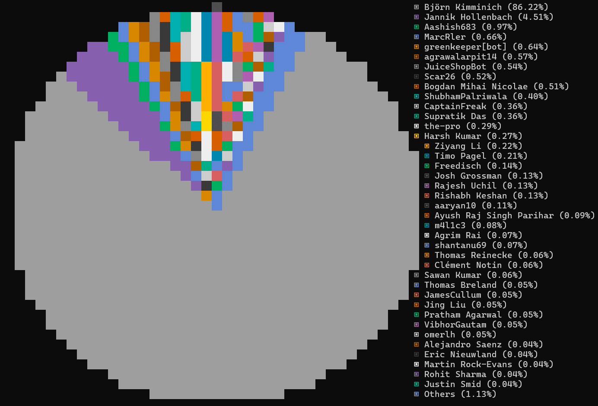

# Hall of Fame

## GitHub Contributors

As reported by [`git-stats -a -s '2014'`](https://www.npmjs.com/package/git-stats) analysis of `master` as of Tue, 12 May
2026 after deduplication with `.mailmap`.

## Translators

As exported from
[CrowdIn Top Members Report](https://crowdin.com/project/owasp-juice-shop/reports/top-members)
(by # of translated words) for all languages as of Tue, 12 May
2026 after [conversion into Markdown](https://thisdavej.com/copy-table-in-excel-and-paste-as-a-markdown-table/).

| Name                               | Languages                   | Translated |
|------------------------------------|-----------------------------|------------|
| Björn Kimminich (bkimminich)       | German                      | 47726      |
| tongsonghua (yolylight)            | Chinese Simplified          | 16872      |
| Pepesr73                           | Polish                      | 15335      |
| Umoxfo                             | Japanese                    | 12772      |
| Derek Chan (ChanDerek)             | Chinese Traditional         | 5411       |
| Bogdan Mihai Nicolae (bogminic)    | Romanian                    | 5102       |
| Yannick (yannickboy15)             | Dutch                       | 3872       |
| NCAA                               | Danish                      | 3855       |
| Enrique Rossel (erossel)           | Spanish                     | 3416       |
| Simon Basset (simbas)              | French                      | 2933       |
| MortenHC                           | Danish                      | 2597       |
| janesmae                           | Estonian                    | 2594       |
| Lawrence Kim (lawkim96)            | Korean                      | 2507       |
| toshiaizawa                        | Japanese                    | 2302       |
| mrtlgz                             | Turkish                     | 2274       |
| schattenbaum                       | German, Switzerland; German | 2181       |
| narges afzali (kotarou-katsura)    | Persian                     | 2164       |
| Jean Novak (jeannovak)             | Portuguese, Brazilian       | 2151       |
| ShahinF27                          | Azerbaijani                 | 2125       |
| Lang Mediator (lang.mediator)      | Russian                     | 1949       |
| htchen99                           | Chinese Traditional         | 1664       |
| Timo Meriläinen (owasp.timo)       | Finnish                     | 1470       |
| Herisatry Lubaba (herisatry)       | French                      | 1465       |
| Dana-Maria Munteanu (danamunteanu) | Romanian                    | 1366       |
| Dmitry (shipko)                    | Russian                     | 1243       |
| Petr Gallus (PetrGallus)           | Czech                       | 1222       |
| sjroh                              | Korean                      | 1214       |
| owangen                            | Norwegian; Danish; Klingon  | 1139       |
| Jonathan Berglin (jonis9898)       | Swedish                     | 1092       |

**Additional translations by:**

Giovanni (cruzgio), Alexander Nissen (Nissen96), fabrizio1979, OrNol (TRNSRL), Jorge Estigarribia (jorgestiga), Pablo Barrera (pablo.barrera), Coink (CoinkWang), Phakphum Visetnut (phakphum_visetnut), Kamil Vavra (vavkamil), Abdo Farwan (abdofarwan), AviD (avidouglen), Marco Cavenati (Marcondiro), Stella Dineva (stella.dineva), Stavros M. (msstavros), Fredrik Bore (Boren), GiorgiSharia, Songrit Kitisriworapan (songritk), Oussama Bouthouri (Boussama), sergio.kubota, Ender Çulha (ecu), Claudio Snidero (cla7997), Marc Rüttler (MarcRler), Davis Freimanis (davisfreimanis), Krystian (kiszkot), r0n1am, no-need-for-a-username, fieldhill13, thinbashane, Tomas Rosenqvist (Muamaidbengt), stejkenzie, rToxic, adeyosemanputra, Kylian Runembert (Kyrune), Andrew Pio (siranen), Filipe Azevedo (filipaze98), Henry Hu (ninedter), zvargun, timexlord, Maria Tiurina (tiurina.maria), ztzxt, Bernhard Hirschmann (bhirschmann20), Daniel Paniagua (danielgpm), Xotak (loulou310), asifnm, Estevam Arantes (Es7evam), anderson silva (anderson.silva), FoteiniAthina, orjen, vientspam, Allan Kimmer Jensen (Saturate), Idomin Ninja (Idomin), BostonLow, Trjman, にのせき (ninoseki), Egert Aia (aiaegert), Nico Ådahl (nigotiator), Lars Grini (lars.grini), quevil, Jan Wolff (jan.wolff.owasp), Emil (EmilMarian), Pär Svedberg (grebdevs), rakzcs, Ido Har-Tuv (IdoHartuv), Karl (spruur), Adriano Pereira Junior (adrianoapj), Albert Camps (campsupc), Zenmaster212, jasinski_tomasz, Daan Sprenkels (dsprenkels), atteism, Aleksandra Niemyska (niemyskaa), Diego Andreé Porras Rivas (andree.rivas), mateomartinez, Rasmus Bidstrup (rasmusbidstrup), Michal (mbiesiad), Koji O (marlboro20light), Bruno Rodrigues (bmvr), MoriRo13, Riotaro OKADA (riotaro), Constantin Mauf-Clausen (cmauf), talisainen, jcmarcflores, Ahmet Duzenci (duzenci), OliverkeHU, GhosteFace, Kitisak Jirawannakool (jkitisak), Bart Decker (Decker), Daniel Christensen (Tejendi), Manu B (Rosina), Mohammad Febri Ramadlan (mohammadfebrir), coavacoffee, bill (Hawxdu), victor goncalves (noxes), Klas Fahlberg (FahlbergKlas), CarlCampbell, Natalia (notNao), Lenka Dubois (lenkadubois), Syahrol, rachidbm, Mattias Persson (mattiasbpersson), André Santos Duarte Fonseca (Andre_Duarte), sp8c3, cello-anders, Meowツ (pondpond22626), isashimitsui, alshon51, Oussama Bouthouri (oussama.bouthouri), HelaBasa Group (HelaBasa), bmoritz, GK (lollipas), landinl, Муслим Шахмурзаев (trenchRat), mrudul, Tetsutaro UEHARA (tetsutalow), Tan Ton (TinTinTheGuy), Héctor Lecuanda (hlecuanda), Michiya Tominaga (nuwaa), Alain Herreman (PapillonPerdu), Anton Krivonosov (anton.krivonosov), Ilkka Savela (ile2021), gray litrot (graylitrot), Martin Hartl (hartlmartin), Mircea Ulmeanu (boltzmann.gt), Bryan Rioux (nayrbrioux), Roy Quiceno (rquiceno), Carlos Allendes (OwaspChile), redr0n19, ilianoKokoro, saetgar, Shivam Soni (i-shivamsoni), ManuelFranz, Daniel sosa (alejandromerino14196), Fernando (Sh4dow-BR), Anthony3000, Yang Lucas (Lucas.y), hugoalh, nilfigo, Richardson Lima (contatorichardsonlima), soledad aro (cristinagarciaaro), Katharina Wittkowsky (kwittkowsky), Frederik Bøgeskov Johnsen (cpfbj), NaveenKumar (QAInsights), Jeremy Vriens (Jeremyvriens), kahfiehudson, Ezequiel Andino (acidobinario), Origami, motofy, dav1ds, Stefan Daugaard Poulsen (cyberzed), Léa (0xLea)

## Special Thanks

* Inspired by the "classic"
  [BodgeIt Store](https://github.com/psiinon/bodgeit) by
  [@psiinon](https://github.com/psiinon)
* Revised OWASP Juice Shop and Juice Shop CTF logo artworks by Emily Gundry (courtesy
  of [@SecureState](https://github.com/SecureState))
* Wallpaper artworks by Mike Branscum (courtesy of
  [@daylightstudio](https://github.com/daylightstudio))
* Official
  [OWASP Juice Shop Jingle](https://soundcloud.com/braimee/owasp-juice-shop-jingle)
  written and performed by [Brian Johnson](https://github.com/braimee)
* Juicy Chat Bot artworks by Kharisma Mulyana (courtesy of
  [Timo Pagel](https://github.com/wurstbrot/))
* Admin profile picture artworks by Kharisma Mulyana (courtesy of
  [Timo Pagel](https://github.com/wurstbrot/))
* OWASP Juice Shop LEGO™ Tower design & prototyping by [Bram Patelski](https://github.com/brampat/)

Additional thanks goes to the contractors we were able to hire for specific work packages over the years with OWASP funding:

* [Pwning OWASP Juice Shop](https://leanpub.com/juice-shop) cover artwork
  by [Patch Kroll](https://99designs.de/profiles/3099878)
* [Banner](https://github.com/OWASP/owasp-swag/tree/master/projects/juice-shop/banners)
  and
  [flyer](https://github.com/OWASP/owasp-swag/tree/master/projects/juice-shop/flyers)
  artwork by [logicainfo](https://99designs.de/profiles/logicainfo)
* [Score Board redesign](https://www.figma.com/file/DwC5ErhRz6gb3eTZEYYriS/Juiceshop-Scoreboard?type=design&node-id=0-1&mode=design) by Vibhuti Arora

## Stargazers (over time)

