# CS467 OWASP Juice Shop How-to Guide


## Injection Vulnerability - OWASP #3
#### Exploiting Injection via DOM XSS
###### By: Kuljot Biring

For this vulnerability it should be noted that Cross-site Scripting (XSS) is a vulnerability that allows an attacker to inject malicious scripts into web pages. They can be used to steal information. Hijack user sessions (cookies) and perform other nefarious actions.

Here we are going to inject a payload into the Document Object Model (DOM). Insecure client-side Javascript is allowing this XSS to take place.

Looking at the Juice Shop webpage, the area that stands out as a place to test any kind of injection or payload would be areas that allow user input. In our case this is the website's search bar.

Since we are just doing a proof of concept lets send a script that contains and alert. First, right click on the webpage and select inspect. This will open developers tools in a separate frame. In the search bar, we will enter: `<h1>Hacking is Cool</h1>`

Press enter. Notice how this shows up on the webpage search results? If we right click and inspect the text we put on the page, we can see it has been inserted into the code.

Now lets try inserting a bit of JavaScript. In the search bar enter the following and hit enter:

```
<iframe src="javascript:alert(`HERE IS AN XSS INJECTION - KULJOT BIRING`)">.
```


_Screen shot of payload in the search bar_


If we search for this string in the page inspector we entered, we can see our iframe has been injected into the code. Now imagine if this had been something much more malicious being injected into our code such as code to steal a user's cookies?


_code inserted into DOM_

#### Remediating the Injection Vulnerability

OK, now that we know we can perform injection attacks via the search bar, we look to how we can remedy this. Let's find the code that deals with the search bar. After some digging we see that in the folder:

```
frontend > src > app > search-result
```
there is a file called `search-result.component.ts`. In this file we can see the following snippet of code which seems to be overriding Angular's built-in safeguards which would prevent an XSS attack.


_image of insecure code_


The solution here is to remedy this code by not bypassing built-in security trusts in the first place.


_code fix_


#### Key Takeaways

XSS allows malicious code to be injected. Without sanitization and security checks, bad actors can perform a number of actions which can lead to various effects such as; running malicious scripts which can steal user information, cookies and run a wide variety of other nefarious code on your webpage. Here we are simply using a DOM XSS to trigger an alert as a proof of concept. However, as you can see, this vulnerability has a lot of potential for harm.

## Vulnerable and Outdated Components - OWASP #6
#### Exploiting Outdated Allowlist
###### By: Jason Gottlieb

For this vulnerability we will be looking at how outdated parts of a web application can be used as an attack vector. Often, websites will want to move users to another website to handle things such as donations or payments. Since developers want to ensure that users are only redirected to websites that are safe, they will ensure that only certain websites can be used as a redirect. The term for this collection of allowed URL's is an Allowlist. If an attacker tries to redirect a user through the site to a URL that they control, it won't work. 

This concept works well to protect users, but can unintentionally be used as an opportunity for scammers when the list is out of date. In this scenario, the Juice Shop has an outdated Allowlist that will let users be redirected to Cryptocurrency wallet sites. In the past, the Juice Shop used one of this wallets for a legitimate purpose, to collect payments from users. However, the Juice Shop has stopped using the wallet but left the URL's in the Allowlist. 

If an attacker was to discover that these URL's are in the Allowlist, they could generate their own wallet URL that is slightly different from the official Juice Shop one and present it to users. Since the URL would redirect through the Juice Shop site, it would be very hard for the average user to tell that this is a scam. Let's go over how an attacker might discover a vulnerable link.

First, right click on the webpage and select inspect. Navigate to the debugger tab and take a look at main.js. From there we can use CTRL-F to search for the string "redirect" until we come accross a URL that could be used as an attack vector.

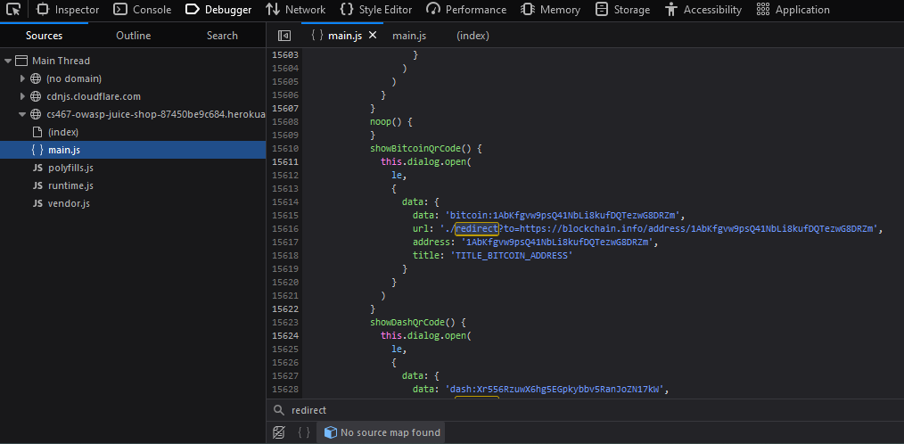

_image of potentially vulnerable URL_


Here we find the following URL:
```
/redirect?to=https://blockchain.info/address/1AbKfgvw9psQ41NbLi8kufDQTezwG8DRZm
```

If we are to paste that into our search bar, we will be redirected to a Cryptocurrency wallet. While this by itself isn't an issue, the Juice Shop no longer uses these wallets to collect payments so we are just leaving an attack vector open with no benefit.

#### Remediating the Outdated Component Vulnerability

The easiest way to fix this vulnerability is to remove those URL's from the Allowlist. Inside the lib folder there is a file called `insecurity.ts` that handles the Allowlist.

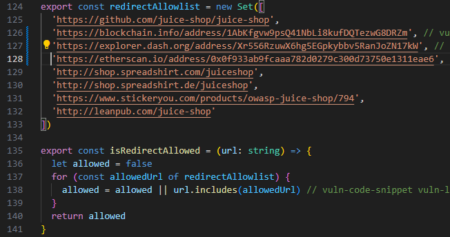

_image of insecure code_

The solution is to remove any URL's that we don't want to  be redirected. Just comment out the appropriate URL's.

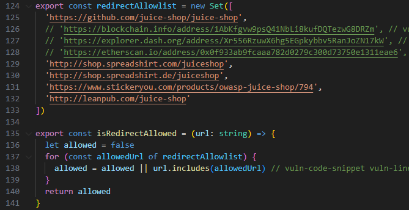

_code fix_

#### Key Takeaways

Allowlists are a powerful tool in controlling where users can be redirected. However, if they fall out of date they can become a serious vulnerability. Developers should strive to make sure that the URL's that are within their Allowlist are secure and can't be used for phishing scams. Additionally, Allowlists should be kept up to date. Developers should add checking their Allowlist to a regular maintenance schedule and frequently audit which URL's are contained within it.

## Cryptographic Failures vulnerability - OWASP #2
#### Exploiting Sensitive Data
###### By: Pontipe Kopkaew

For this vulnerability, we will exploit a confidential document. The goal is to find a hidden file containing sensitive information about potential hostile takeovers by management. By exploring various links within the application, we should be able to locate this unprotected file and access its contents.

To begin, we do not need any tools to exploit the vulnerability; instead, we should thoroughly explore the Juice Shop website, looking for links that might lead to embedded documents.

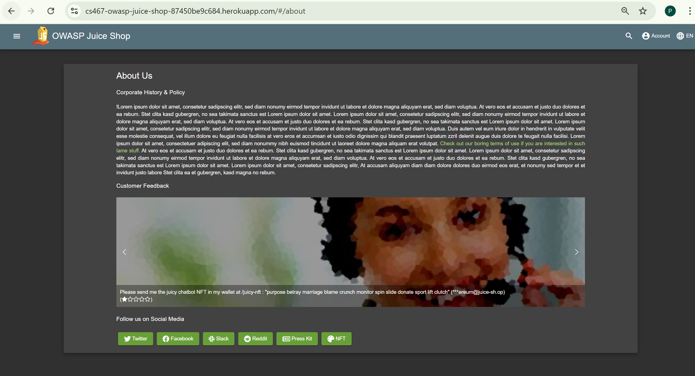

_screenshot of About Us Page_

There is a link on the "About Us" page that directs users to the terms of use, which leads to the URL: https://cs467-owasp-juice-shop-87450be9c684.herokuapp.com/ftp/legal.md. From this, we can deduce that the document is named legal.md and is located in the ftp directory, prompting us to investigate further.

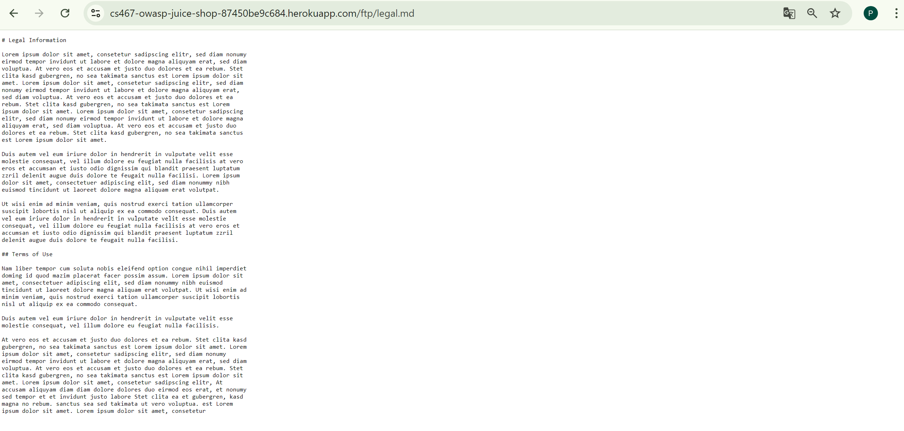

_screenshot of the content of legal.md_

The next step is to navigate to the directory at https://cs467-owasp-juice-shop-87450be9c684.herokuapp.com/ftp to check its contents.

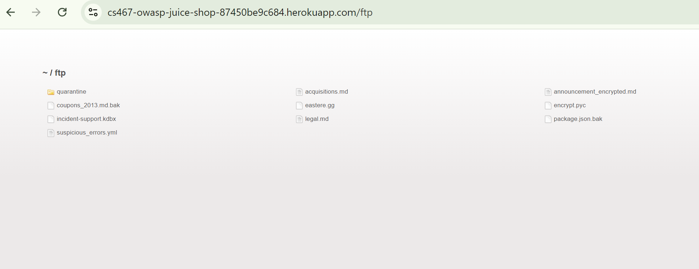

_screenshot of the content of the ftp directory_

Finally, if we examine the contents of the directory, we will discover that acquisitions.md is the file containing the sensitive data we are seeking.

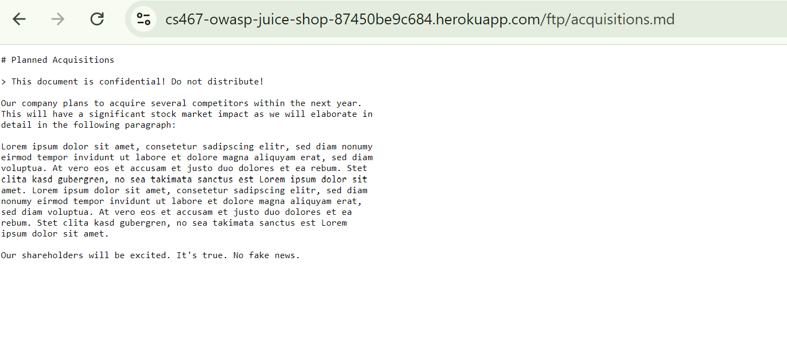

_screenshot of the content of acquisitions.md_

#### Remediating Cryptographic Failures vulnerability

To address this issue, we should eliminate access to the directory listing of /ftp directory by commenting out the relevant code snippet in the server.ts file of the application. This code creates an endpoint that serves a directory listing of the ftp folder, which can be a potential security risk if not properly secured, as it could expose sensitive files to unauthorized users. By taking this action, we effectively resolve the data leak.

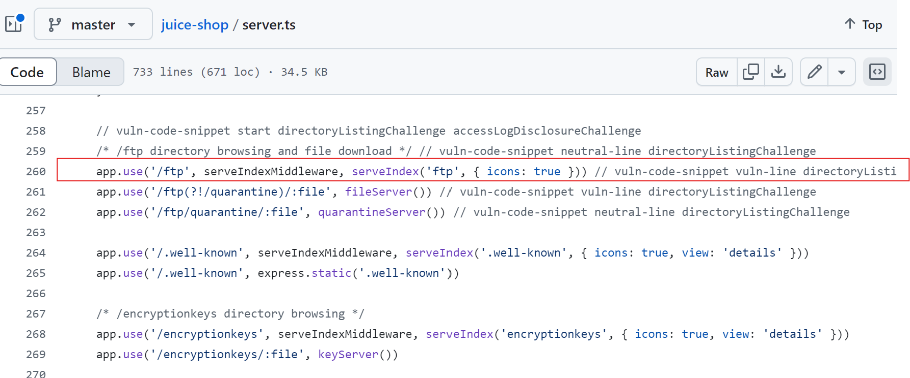

_screenshot of insecure code snippet from GitHub_

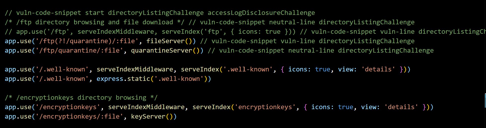

_screenshot of secure code snippet from code editor_

#### Key Takeaways

The key takeaway from this exploit is the importance for organizations to prioritize strong data protection measures to keep sensitive information safe. Protecting data is important not only for maintaining customer trust but also for complying with legal regulations and avoiding potential financial losses. Regularly reviewing and enhancing security practices is vital for reducing risks and ensuring that data is secure from potential threats.

## Injection Vulnerability - OWASP #3
#### Exploiting SQL Injection
###### By: Jason Gottlieb

For this vulnerability we will be looking at how directly passing user input to a SQL Query can lead to an injection attack. When allowing users to log in, the Juice Shop has a user type in their email and password. On the back end, the inputs are passed into a SQL Query that checks a table of emails and passwords. If the email and password matches what is on record, a token is passed back to the user that allows them to log in. This is standard practice for logging users into a service. The Juice Shop makes a mistake however when they do not check the user input to make sure that they are only putting in a valid email.

When the user inputs their email, their input is directly slotted into the SQL Query to the database. Since there is no sanitization, it is possible for a knowledgable attacker to hijack the SQL Query and input their own commands. Let's take a look at how this might be accomplished. We begin by navigating to the login page, opening up the browser inspector, and going to the "Network" tab.

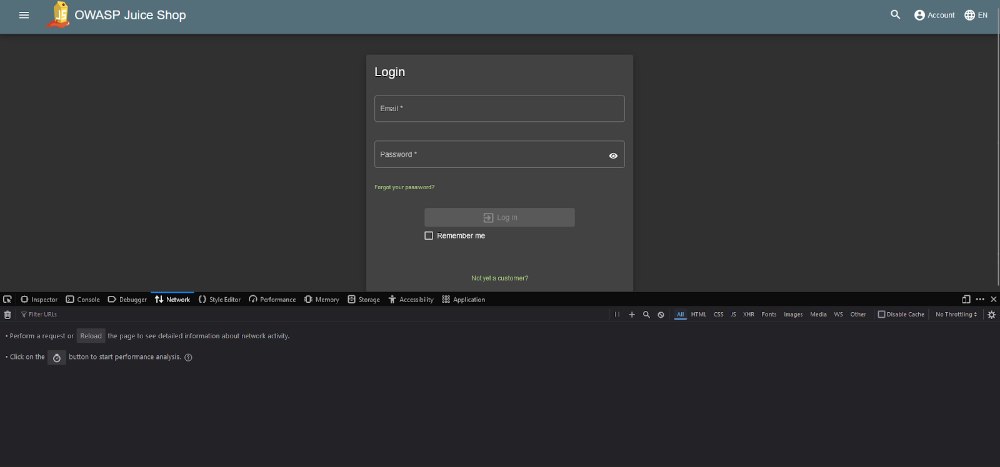

_image of login page and network tab_

We can test to see if the login page might be vulnerable to an SQL Injection attack by putting an apostraphe in the email input and anything we want for the password. In this case I used "123"

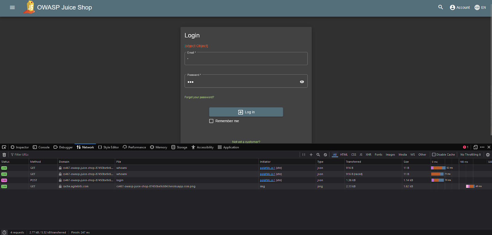

_testing the login page for an SQL Injection Vulnerability_

We can hit login and check the response from the server to see the exact SQL Query that was sent


_response from the server_

The query that was sent was as follows:
```
"SELECT * FROM Users WHERE email = ''' AND password = '202cb962ac59075b964b07152d234b70' AND deletedAt IS NULL" 
```

We can see from this query that in the email section, the apostrophe was simply passed in without problems. This is a major security issue since in SQL, apostrophes can be used to start a new command. If someone knows what they are doing, they could enter their own SQL Query inside of the one we are trying to send. Normally a developer would not allow an apostrophe to be entered in email input for this reason.

Now that we know that we can inject our own SQL, we can try to gain access to the Admin account. 

This time in the email we will type:
```
' OR TRUE -- 
```
Let's take a look at what happens when we do this

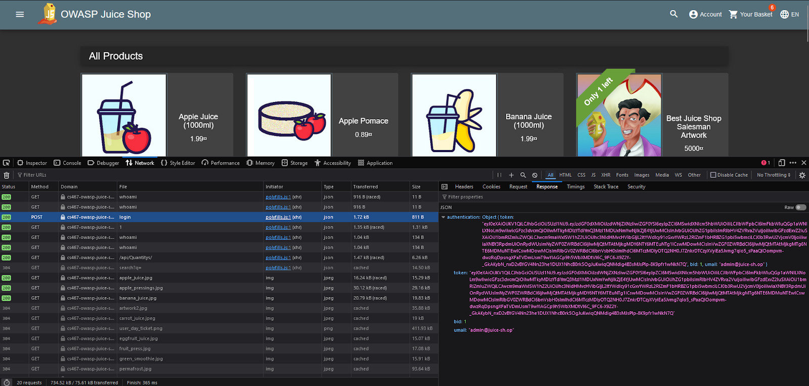

_successful response from the server_

This time when we go to login, we are given a valid access toekn and logged in. If we were to navigate to the Account tab we would see that we are logged in as an admin. What happened here?

Well we know that inputs are not sanitized when entered into the user login so we sent the following query:
```
"SELECT * FROM Users WHERE email = ' ' OR TRUE--  AND password = '202cb962ac59075b964b07152d234b70' AND deletedAt IS NULL" 
```

We have asked SQL to return the passwords for all users where the email address is ‘ ‘ or if the second expression is True. Since True is always True, it returns the full list of User passwords. We then use the – to comment out the rest of the hard coded SQL statement and just run our injection. In the case of the Juice Shop, the Admin account is the very first one in the list, so we are logged in as the admin.

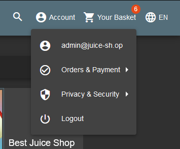

_we are logged in as an admin_

#### Remediating the SQL Injection Vulnerability

We can remedy this exploit by sanitizing user inputs before running our SQL Queries. Searching through the code, we can find the relevant functions that handle user login.

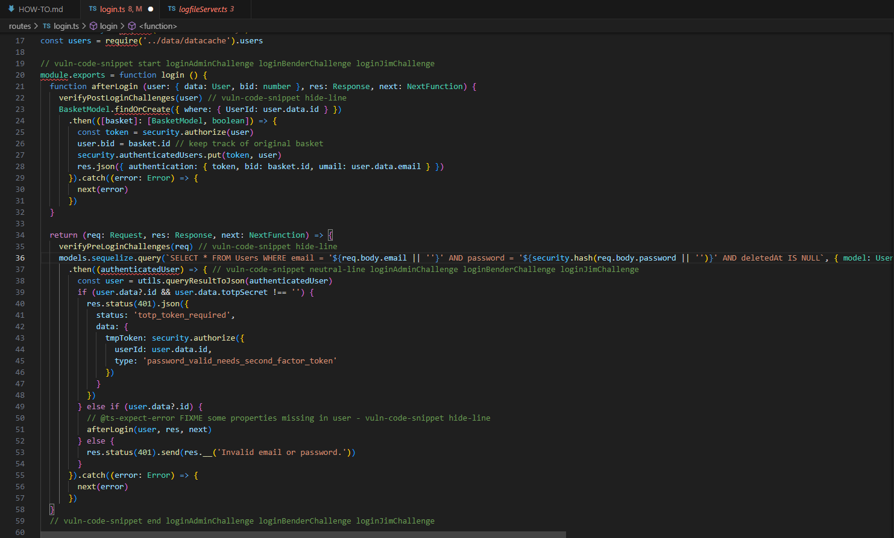

_insecure login code_

The important part for us is on line 36 where we can see that there is no sanitization being done on our SQL Query. Inputs from our login request are being directly input to the Query. 

This can be fixed using something called binding. This is considered safe because Juice Shop uses a package called Sequelize to handle its SQL Queries. When Sequelize binds a parameter, it does a check to ensure that Bind parameters are not SQL keywords. This makes it impossible for an attacker to inject their own statement because Sequelize will throw an error if it sees an apostrophe or other SQL keyword. These keywords are not normally part of emails so it shouldn’t be an issue if we don’t allow them to be input. 

The fixed code looks like this:

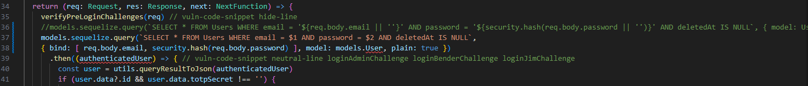

_fixed code_

Here you can see where we use our Bind parameters ($1 and $2) so that Sequelize will sanitize the inputs. 

#### Key Takeaways

The biggest takeaway from this exploit is that it is important for developers to be educated in website security. If a developer does not know that this is an avenue for attack, they will not be able to protect the site from SQL injection. Since this code works by just placing user input into our SQL statements, an uneducated developer will have a hard time understanding that they have written a major vulnerability into the site. 

It is important for developers to know how SQL injection works so that they can select secure packages to handle their SQL Queries and take full advantage of the security measures that they offer.
## Broken Access Control Vulnerability - OWASP #1
#### Exploiting Broken Acess Controls via Forging another user's review
###### By: Kuljot Biring

In this vulnerability, I we will be taking advantage of broken access controls in OWASP Juice Shop. These vulnerabilities occur when an applicaiton does not properly restrict user permissions and allows unauthorized users to access or modify resources. This usually results from having inadequate authentication checks or failing to enfoce access controls at the applicaiton level. Attackers can take advantage of these weaknesses to access sensitive data or take unauthorized actions including but not limited to escalating priveledges. 

In investigating proper access controls for the Web Application, I noticed that a user can forge another user's review on the products page. 

To exploit this vulnerability we are going to need to have [Burp Suite](https://portswigger.net/burp/communitydownload) downloaded and installed. We are going to use this popular Web Security software to "catch" requests we make to the website on the fly (as we send them over).

We open up the Burp Suite application and just accept the default settings and make a Temporary Project in Memory option with the default settings, and then click Start Burp.

In the tabs on the top of the application select Proxy and on that screen slide the toggle for Intercept to be in the ON position. Now click the open browser button which will launch a web browser. Note: you will have to click forward as the GET (or other HTTP request) are getting processed for the page to load and to move forward with your actions.

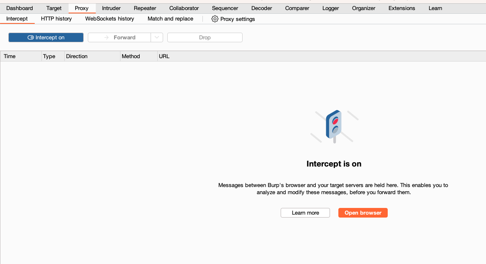
_screenshot of Bupr Proxy Tab_

In this browser we want to navigate to [OWASP Juice Shop](https://juice-shop.herokuapp.com/#/search) and click Account in the top right. We want to create a new user via the ```Not yet a cutomer?``` link.

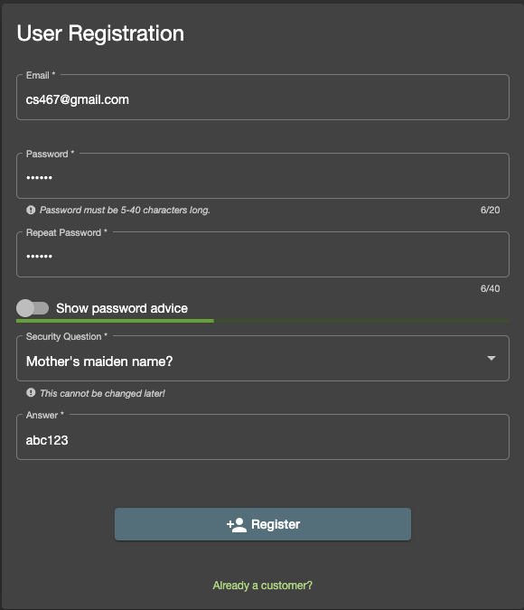
_screenshot of creating a new account_

Once we have created a new user, go ahead and log in as the user you just created. On the main page of the website, we can take a look at the Apple Juice product. We can see that there is a review there currently when we click on the product:

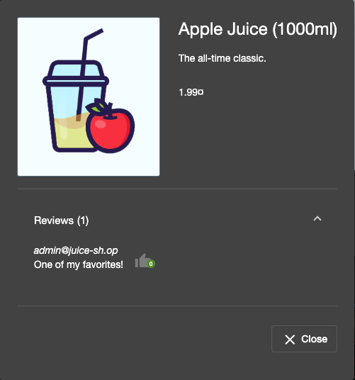
_screenshot of comment on Apple Juice product_

Let's leave one of our own comments on the product. Now, in Burp Suite we see our PATCH appear. Before we press forward let's take a closer look at the request. At the very bottom of the Request window in Burp Suite we can see our email that is submitting the review listed as author as well as the message for we had written for the review.

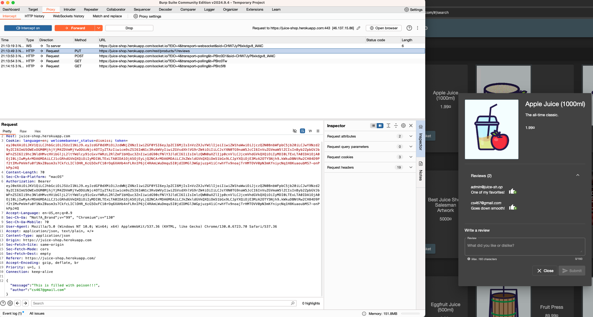
_screenshot of PUT request in Burp Suite_

Go ahead and forward this request. We see that our review shows up as expected. No surprise here. 

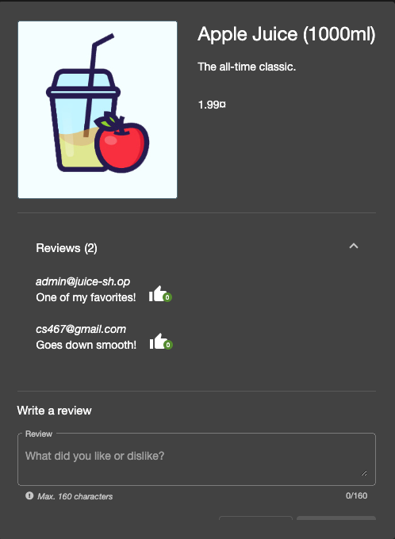
_screenshot of our new review_

Since we are able to intercept and examine the request before it's sent through, let us test if there is any authentication in the method that handles this. Let's craft a new review that says ```This is filled with poison```. However, before we forward the request in Burp Suite let's change the author. We saw that the first review was left by admin@juice-sh.op. We know this is a valid authenticated user (since they are able to leave comments), so let's use this as the author in the request instead of our own cs467@gmail.com. See below:


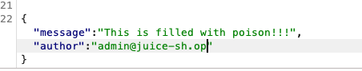
_screenshot of editing author in new review PUT request_

Forward the request. Look at what happened! A new review is left with the admin of juice shop saying the product is filled with poison. We were able to forge a comment as the Juice Shop admin!

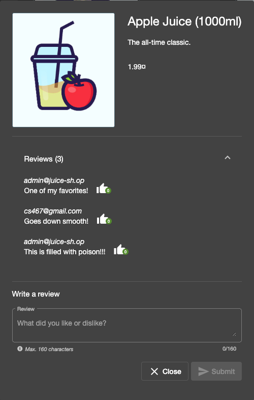
_screenshot of forged admin review_

What happened here? I seems as though there is a seriously flaw in the way that authentication and authorization are handled on the web app. The application is not checking that the person logged in is only able to leave reviews as themselves. There is definately a Broken Acccess Control vulnerability in the web application.


#### Remediating the Broken Access Control Vulnerability

Now that we have exploited the vulnerability, let's remediate it to patch this security issue. Looking through the code we can see that the file ```updateProductReviews.ts``` appears to be handling the review functionality of the web site. Taking a deeper look at the source code, we can see that it processes incoming request to update a review, checks for the authentication of the user and then updates the review message in the database if the user is authorized to do so. The vulnerable code is here:


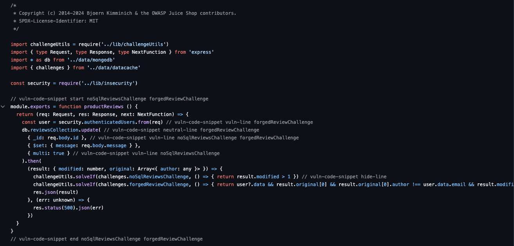
_screenshot of vulnerable code_

The issues with this code are; the code does not check whether the authenticated user is the actual author the the review (as we demonstrated any user can author a review for another user). The lines of code allowing this are below:

```
const user = security.authenticatedUsers.from(req) // vuln-code-snippet vuln-line forgedReviewChallenge
    db.reviewsCollection.update( // vuln-code-snippet neutral-line forgedReviewChallenge
      { _id: req.body.id }, // vuln-code-snippet vuln-line noSqlReviewsChallenge forgedReviewChallenge
      { $set: { message: req.body.message } }
      { multi: true } // vuln-code-snippet vuln-line noSqlReviewsChallenge
```

To remedy this issue, we are going to do an authentication check before that snippet of code:

```
if (!user) {
      return res.status(401).json({ error: 'Unauthorized' });
    }
```

We also add code to ensure that before directly updating the review there is appropriate ownership via changing the three problematic lines above. We also remove the ability to edit multiple review entries via a well crafted SQL command:
```
{ _id: req.body.id, author: user.data.email }, // vuln-code-snippet vuln-line noSqlReviewsChallenge forgedReviewChallenge
// Only allow message update, do not allow author to be changed
{ $set: { message: req.body.message, author: user.data.email } },
{ multi: false } 
```

In the same vein we need to check the authorization of the author as well as ensure the user has not entered anything unexpected using:

```
if (!review || typeof review.author !== 'string' || review.author !== user.data.email) {
          // user is not authorized to edit review
          return res.status(403).json({ error: 'Forbidden' });
        }
```

This ensure that only the user who originally posted a review can modify it. Now we have handled Authentication and Authorization of Access Controls.

Additionally the database operation is using ```result.original``` without any sanitization. If this becomes undefined or malformed the logic could break as there is no checking as to the integrity of the response from the database query.

To remedy this, we are going to add checking to see if the ```result.original``` exists and whether it has any elements. If it's null or empty, the DB likely didn't return expected data - we can handle that gracefully with an error.

```
if (!result.original || result.original.length === 0) {
            return res.status(500).json({ error: 'Failed to retrieve the original review' });
          }
```

Lastly, the error handling in the code uses a generic ```500`` response for all errors which would not provide enough context or detail about the issue that occurred. An error message with more context (i.e database errors, authorization errors etc) woudl be more beneficial. We update the error block as follows:

```
.catch((err: Error) => {
      // Handle other potential errors like connection issues
      console.error('Error fetching review:', err);
      res.status(500).json({ error: 'Failed to fetch review' });
    });
```

#### Key Takeaways

Broken Access Controls allows individuals to peform actions for which they should not be authorized. In our example, we used broken access controls to forge reviews on products. This proof of concepts highlights the need to have proper controls in place which strictly control Authentication - verifying the entity is who they claim to be, Authorization - allowing the entity to perform only actions that have been specifically granted to them, and Accounting - keeping track of the entity's actions. Without these measures in place, a malicious actor can bypass safeguards and perform a plethora of nefarious actions.

### Special Note:
There is a known bug with the code and the current solution and the recommended solution does not fix the vulnerability. This has been documented as an 
(Code Issue](https://github.com/juice-shop/juice-shop/issues/2389) and the project lead has been made aware of the problem. The professor also has been notified
and concurs with the decision to document the problem and move to the next vulnerability.

## Identification and Authentication Failures vulnerability - OWASP #7
#### Password Strength
###### By: Pontipe Kopkaew

For this vulnerability, we will exploit password strength. The goal is to log in with the administrator's user credentials without previously changing them or applying SQL Injection.

We will use Burp Suite, a popular tool for intercepting and modifying HTTP requests. The steps to exploit the vulnerability are as follows:

To begin, The administrator's email address is already given in the product page, under the reviews section. It is admin@juice-sh.op. 

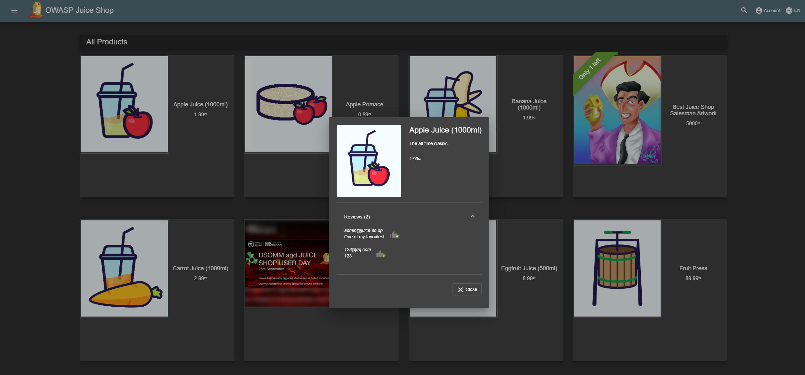

_screenshot of the products page displaying the admin email address_

Next, we have to guess the password. The challenge requires us to find the admin's password without changing it or using SQL injection. We can rely on the fact that many systems have weak or predictable passwords, especially for admin accounts. 

To do this, Let's capture the admin login request using Burp Suite's Interceptor feature.

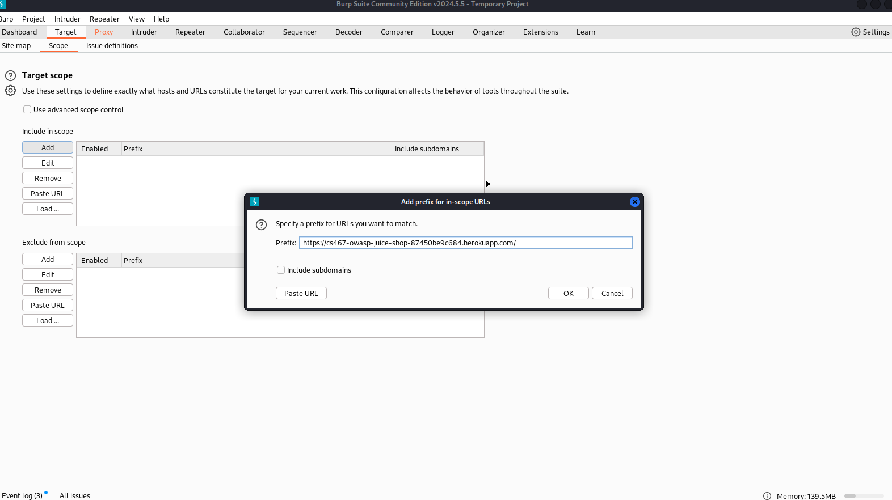

_screenshot of Burp Suite setup_

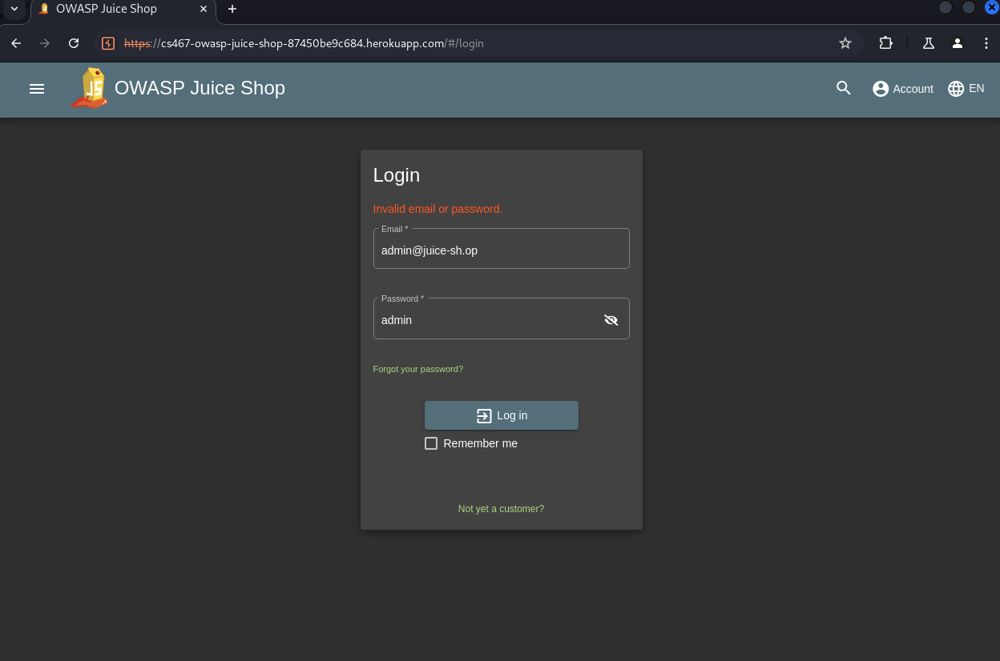

_screenshot of failed attempt to log in_

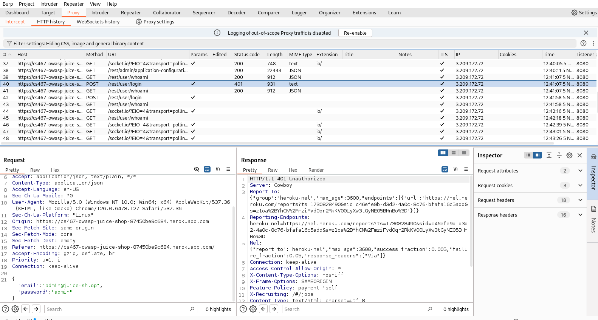

_screenshot of the Burp Suite Proxy result_

Pick a  list of common passwords (e.g., admin, password123, 123456, etc.), which are often used in weak password configurations. The Intruder feature in Burp Suite to automate the process of guessing the password. This tool allowed me to send a series of requests with different password combinations, automatically testing them against the login endpoint until the correct one was found.

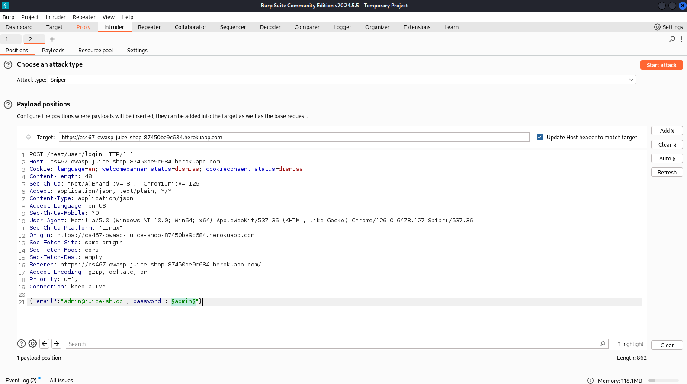

_screenshot of Burp Suite intruder result_

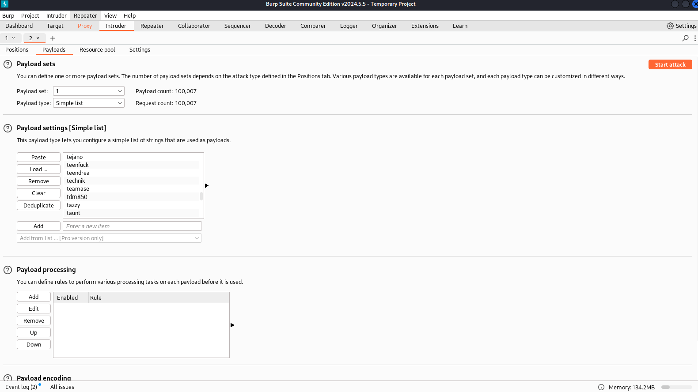

_screenshot of the intruder payload setup_

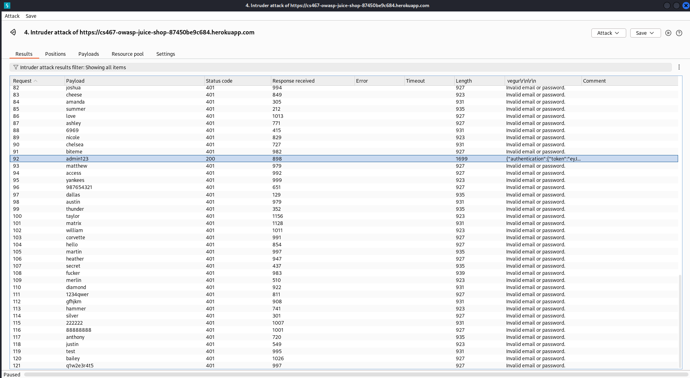

_screenshot of the the processing of the passwords list_

As shown in the screenshot above, the password "admin123" returns a status code 200, indicating a successful login. By testing this password, we are able to gain access with the correct credentials. This proved that the admin's password is weak and vulnerable to brute-force or simple guessing attacks.

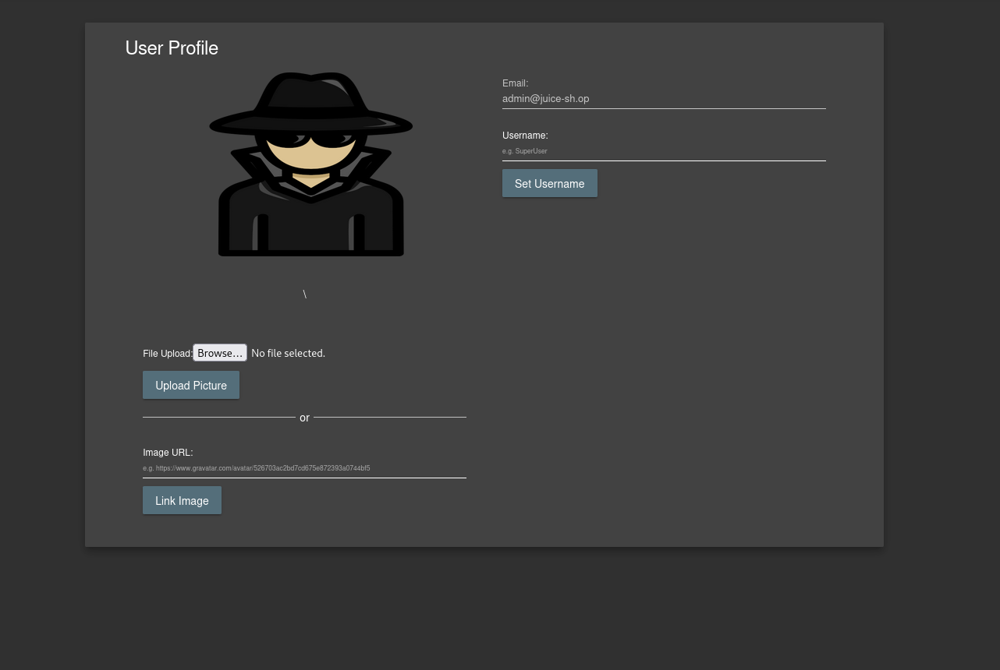

_screenshot of the user's profile_

#### Remediating Identification and Authentication Failures vulnerability
To address the password strength vulnerability in the register form (\frontend\src\app\register) of the OWASP Juice Shop, I reinforced the validation logic to ensure that passwords meet specific strength criteria. These changes were made in the following files:

- Code 1: register.component.html

    I added validation feedback to the front-end form to notify users about password strength requirements. Specifically, I created a list of password criteria (such as minimum length, inclusion of digits, special characters, and prevention of common passwords), and displayed real-time feedback to users.

    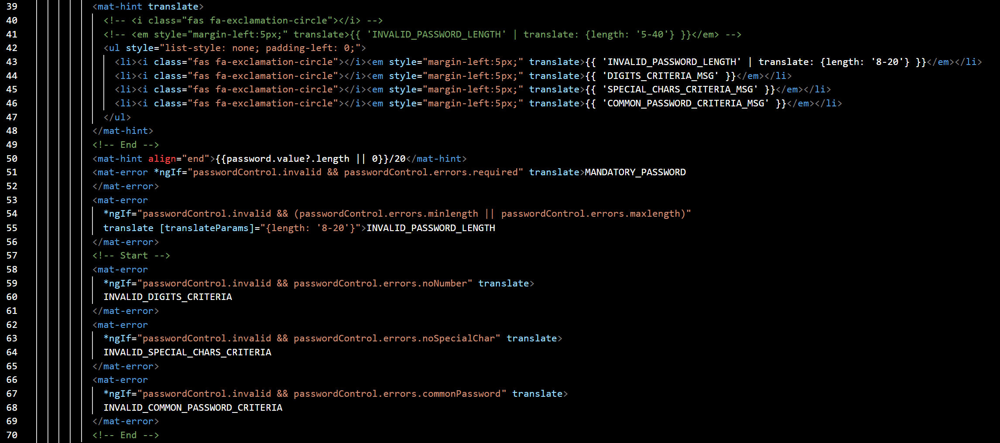

    _screenshot of the code snippet from register.component.html_

- Code 2: register.component.spec.ts

    I added unit tests to ensure that the password validation logic was working as expected. These tests cover various scenarios, such as password length, inclusion of numbers and special characters, and ensuring the password is not one of the most common passwords.

    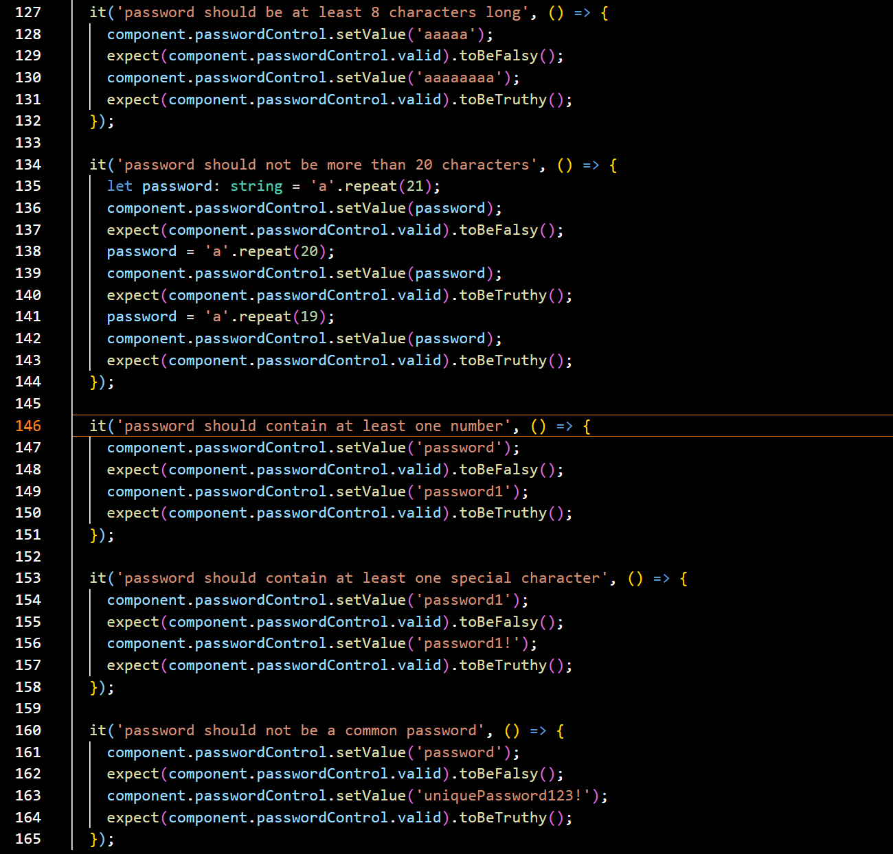

    _screenshot of the code snippet from register.component.spec.ts_

- Code 3: register.component.ts

    To implement the password validation logic on the back-end, I modified the password validator function to check for several criteria. These include checking the password length, ensuring the password contains at least one digit, at least one special character, and that the password is not a common password.

    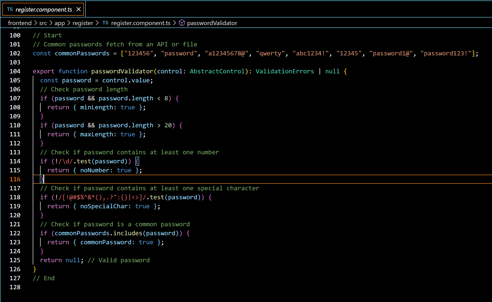

    _screenshot of the code snippet from register.component.ts_

#### Key Takeaways
The major takeaways from this exploit highlight the risks posed by weak passwords, which are common targets for attackers. Predictable passwords like "admin" or "password123" leave systems vulnerable to unauthorized access, especially when combined with automated attack tools like Burp Suite or Hydra, which can quickly perform brute-force attacks. To mitigate such vulnerabilities, it is important to implement strong authentication controls, including enforcing complex password policies, setting up account lockout mechanisms to thwart brute-force attempts, and utilizing multi-factor authentication (MFA) for added security, particularly for administrative accounts.


