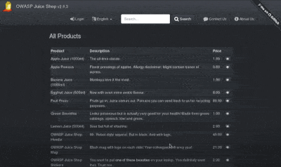

#  OWASP Juice Shop [](https://www.owasp.org/index.php/OWASP_Project_Inventory#tab=Flagship_Projects) [](https://github.com/bkimminich/juice-shop/releases/latest) [](https://twitter.com/owasp_juiceshop)

[](https://travis-ci.org/bkimminich/juice-shop)
[](https://cloud.docker.com/repository/docker/bkimminich/juice-shop/builds)
[](https://codeclimate.com/github/bkimminich/juice-shop/test_coverage)
[](https://codeclimate.com/github/bkimminich/juice-shop/maintainability)
[](https://bestpractices.coreinfrastructure.org/projects/223)


> [The most trustworthy online shop out there.](https://twitter.com/dschadow/status/706781693504589824)
> ([@dschadow](https://github.com/dschadow)) —
> [The best juice shop on the whole internet!](https://twitter.com/shehackspurple/status/907335357775085568)
> ([@shehackspurple](https://twitter.com/shehackspurple)) —
> [Actually the most bug-free vulnerable application in existence!](https://youtu.be/TXAztSpYpvE?t=26m35s)
> ([@vanderaj](https://twitter.com/vanderaj)) —
> [First you 😂😂then you 😢](https://twitter.com/kramse/status/1073168529405472768)
> ([@kramse](https://twitter.com/kramse))

OWASP Juice Shop is probably the most modern and sophisticated insecure
web application! It can be used in security trainings, awareness demos,
CTFs and as a guinea pig for security tools! Juice Shop encompasses
vulnerabilities from the entire
[OWASP Top Ten](https://www.owasp.org/index.php/OWASP_Top_Ten) along
with many other security flaws found in real-world applications!



For a detailed introduction, full list of features and architecture
overview please visit the official project page:
<http://owasp-juice.shop>

## Setup

> You can find some less common installation variations in
> [the _Running OWASP Juice Shop_ documentation](https://bkimminich.gitbooks.io/pwning-owasp-juice-shop/content/part1/running.html).

### Deploy on Heroku (free ($0/month) dyno)

1. [Sign up to Heroku](https://signup.heroku.com/) and
   [log in to your account](https://id.heroku.com/login)
2. Click the button below and follow the instructions

[](https://heroku.com/deploy)

> This is the quickest way to get a running instance of Juice Shop! If
> you have forked this repository, the deploy button will automatically
> pick up your fork for deployment! As long as you do not perform any
> DDoS attacks you are free to use any tools or scripts to hack your
> Juice Shop instance on Heroku!

### From Sources


1. Install [node.js](#nodejs-version-compatibility)
2. Run `git clone https://github.com/bkimminich/juice-shop.git` (or
   clone [your own fork](https://github.com/bkimminich/juice-shop/fork)
   of the repository)
3. Go into the cloned folder with `cd juice-shop`
4. Run `npm install` (only has to be done before first start or when you
   change the source code)
5. Run `npm start`
6. Browse to <http://localhost:3000>

### Packaged Distributions

[](https://github.com/bkimminich/juice-shop/releases/latest)
[](https://sourceforge.net/projects/juice-shop/)

1. Install a 64bit [node.js](#nodejs-version-compatibility) on your
   Windows, MacOS or Linux machine
2. Download `juice-shop-<version>_<node-version>_<os>_x64.zip` (or
   `.tgz`) attached to
   [latest release](https://github.com/bkimminich/juice-shop/releases/latest)
3. Unpack and `cd` into the unpacked folder
4. Run `npm start`
5. Browse to <http://localhost:3000>

> Each packaged distribution includes some binaries for `sqlite3` and
> `libxmljs` bound to the OS and node.js version which `npm install` was
> executed on.

### Docker Container

[](https://registry.hub.docker.com/u/bkimminich/juice-shop/)
[](https://registry.hub.docker.com/u/bkimminich/juice-shop/)

[](https://microbadger.com/images/bkimminich/juice-shop "Get your own image badge on microbadger.com")
[](https://microbadger.com/images/bkimminich/juice-shop "Get your own version badge on microbadger.com")

1. Install [Docker](https://www.docker.com)
2. Run `docker pull bkimminich/juice-shop`
3. Run `docker run --rm -p 3000:3000 bkimminich/juice-shop`
4. Browse to <http://localhost:3000> (on macOS and Windows browse to
   <http://192.168.99.100:3000> if you are using docker-machine instead
   of the native docker installation)

### Vagrant

1. Install [Vagrant](https://www.vagrantup.com/downloads.html) and
   [Virtualbox](https://www.virtualbox.org/wiki/Downloads)
2. Run `git clone https://github.com/bkimminich/juice-shop.git` (or
   clone [your own fork](https://github.com/bkimminich/juice-shop/fork)
   of the repository)
3. Run `cd vagrant && vagrant up`
4. Browse to [192.168.33.10:3000](http://192.168.33.10:3000)

> The Juice Shop is also included in the
> [OWASP SamuraiWTF](https://github.com/SamuraiWTF/samuraiwtf) Linux VM
> which comes with tools for web penetration testing wrapped in a
> convenient Vagrant Box.

### Amazon EC2 Instance

1. In the _EC2_ sidenav select _Instances_ and click _Launch Instance_
2. In _Step 1: Choose an Amazon Machine Image (AMI)_ choose an _Amazon
   Linux AMI_ or _Amazon Linux 2 AMI_
3. In _Step 3: Configure Instance Details_ unfold _Advanced Details_ and
   copy the script below into _User Data_
4. In _Step 6: Configure Security Group_ add a _Rule_ that opens port 80
   for HTTP
5. Launch your instance
6. Browse to your instance's public DNS

```
#!/bin/bash
yum update -y
yum install -y docker
service docker start
docker pull bkimminich/juice-shop
docker run -d -p 80:3000 bkimminich/juice-shop
```

### Azure Container Instance

1. Open and login (via `az login`) to your
   [Azure CLI](https://azure.github.io/projects/clis/) **or** login to
   the [Azure Portal](https://portal.azure.com), open the _CloudShell_
   and then choose _Bash_ (not PowerShell).
2. Create a resource group by running `az group create --name <group
   name> --location <location name, e.g. "centralus">`
3. Create a new container by running `az container create
   --resource-group <group name> --name <container name> --image
   bkimminich/juice-shop --dns-name-label <dns name label> --ports 3000
   --ip-address public`
4. Your container will be available at `http://<dns name
   label>.<location name>.azurecontainer.io:3000`

## Node.js version compatibility

OWASP Juice Shop officially supports the following versions of
[node.js](http://nodejs.org) in line as close as possible with the
official [node.js LTS schedule](https://github.com/nodejs/LTS). Docker
images and packaged distributions are offered accordingly.

| node.js  | Supported            | [Packaged Distributions](#packaged-distributions)                                                                                                                                                                                                                 | [Docker image](#docker-container) tags                                                       |
|:---------|:---------------------|:------------------------------------------------------------------------------------------------------------------------------------------------------------------------------------------------------------------------------------------------------------------|:---------------------------------------------------------------------------------------------|
| __12.x__ | :heavy_check_mark:   | [](https://github.com/bkimminich/juice-shop/releases/latest) [](https://github.com/bkimminich/juice-shop/releases/latest) [](https://github.com/bkimminich/juice-shop/releases/latest) | __`latest`__ (current official `master` release), `snapshot` (preview from `develop` branch) |
| 11.x     | (:heavy_check_mark:) |                                                                                                                                                                                                                                                                   |                                                                                              |
| 10.x     | :heavy_check_mark:   | [](https://github.com/bkimminich/juice-shop/releases/latest) [](https://github.com/bkimminich/juice-shop/releases/latest) [](https://github.com/bkimminich/juice-shop/releases/latest) |                                                                                              |
| <10.x    | :x:                  |                                                                                                                                                                                                                                                                   |                                                                                              |

## Demo

Feel free to have a look at the latest version of OWASP Juice Shop:
<http://demo.owasp-juice.shop>

> This is a deployment-test and sneak-peek instance only! You are __not
> supposed__ to use this instance for your own hacking endeavours! No
> guaranteed uptime! Guaranteed stern looks if you break it!

## Customization

Via a YAML configuration file in `/config`, the OWASP Juice Shop can be
customized in its content and look & feel.

For detailed instructions and examples please refer to
[our _Customization_ documentation](https://bkimminich.gitbooks.io/pwning-owasp-juice-shop/content/part1/customization.html).

## CTF-Extension

If you want to run OWASP Juice Shop as a Capture-The-Flag event, we
recommend you set it up along with a [CTFd](https://ctfd.io) or
[FBCTF](https://github.com/facebook/fbctf) server conveniently using the
official
[`juice-shop-ctf-cli`](https://www.npmjs.com/package/juice-shop-ctf-cli)
tool.

For step-by-step instructions and examples please refer to
[the _Hosting a CTF event_ chapter](https://bkimminich.gitbooks.io/pwning-owasp-juice-shop/content/part1/ctf.html)
of our companion guide ebook.

## Troubleshooting [](https://gitter.im/bkimminich/juice-shop)

If you need help with the application setup please check our
[our existing _Troubleshooting_](https://bkimminich.gitbooks.io/pwning-owasp-juice-shop/content/appendix/troubleshooting.html)
guide. If this does not solve your issue please post your specific
problem or question in the
[Gitter Chat](https://gitter.im/bkimminich/juice-shop) or on
[Reddit](https://www.reddit.com/r/owasp_juiceshop).

:stop_sign: Please avoid opening GitHub issues for support requests or
questions!

## Documentation

### Pwning OWASP Juice Shop [](https://leanpub.com/juice-shop) [](https://leanpub.com/juice-shop) [](https://www.goodreads.com/review/edit/33834308)

This is the official companion guide to the OWASP Juice Shop. It will
give you a complete overview of the vulnerabilities found in the
application including hints how to spot and exploit them. In the
appendix you will even find complete step-by-step solutions to every
challenge. [Pwning OWASP Juice Shop](https://leanpub.com/juice-shop) is
published with
[GitBook](https://www.gitbook.com/book/bkimminich/pwning-owasp-juice-shop)
under
[CC BY-NC-ND 4.0](https://creativecommons.org/licenses/by-nc-nd/4.0/)
and is available **for free** in PDF, Kindle and ePub format. You can
also
[browse the full content online](https://bkimminich.gitbooks.io/pwning-owasp-juice-shop/content)!

[](https://leanpub.com/juice-shop)

### Slide Decks

* [Introduction Slide Deck](http://bkimminich.github.io/juice-shop) in
  HTML5
* [PDF of the Intro Slide Deck](docs/OWASP%20Juice%20Shop%20-%20An%20intentionally%20insecure%20JavaScript%20Web%20Application.pdf)

## Contributing [](https://github.com/bkimminich/juice-shop/graphs/contributors) [](http://standardjs.com/) [](https://crowdin.com/project/owasp-juice-shop) [](https://www.bountysource.com/teams/juice-shop)  

We are always happy to get new contributors on board! Please check
[CONTRIBUTING.md](CONTRIBUTING.md) to learn how to
[contribute to our codebase](CONTRIBUTING.md#code-contributions) or the
[translation into different languages](CONTRIBUTING.md#i18n-contributions)!

## References

Did you write a blog post, magazine article or do a podcast about or
mentioning OWASP Juice Shop? Or maybe you held or joined a conference
talk or meetup session, a hacking workshop or public training where this
project was mentioned?

Add it to our ever-growing list of [REFERENCES.md](REFERENCES.md) by
forking and opening a Pull Request!

## Merchandise

* On [Spreadshirt.com](http://shop.spreadshirt.com/juiceshop) and
  [Spreadshirt.de](http://shop.spreadshirt.de/juiceshop) you can get
  some swag (Shirts, Hoodies, Mugs) with the official OWASP Juice Shop
  logo
* On
  [StickerYou.com](https://www.stickeryou.com/products/owasp-juice-shop/794)
  you can get variants of the OWASP Juice Shop logo as single stickers
  to decorate your laptop with. They can also print magnets, iron-ons,
  sticker sheets and temporary tattoos.

The most honorable way to get some stickers is to
[contribute to the project](https://bkimminich.gitbooks.io/pwning-owasp-juice-shop/content/part3/contribution.html)
by fixing an issue, finding a serious bug or submitting a good idea for
a new challenge!

We're also happy to supply you with stickers if you organize a meetup or
conference talk where you use or talk about or hack the OWASP Juice
Shop! Just
[contact the mailing list](mailto:owasp_juice_shop_project@lists.owasp.org)
or [the project leader](mailto:bjoern.kimminich@owasp.org) to discuss
your plans! !

## Donations

### PayPal [](https://www.paypal.com/cgi-bin/webscr?cmd=_donations&business=paypal%40owasp%2eorg&lc=BM&item_name=OWASP%20Juice%20Shop%20Project&item_number=OWASP%20Foundation&no_note=0&currency_code=USD&bn=PP%2dDonationsBF)

PayPal donations via above button go to the OWASP Foundations and are
earmarked for "Juice Shop". This is the preferred and most convenient
way to support the project.

### Credit Card (through RegOnline)

OWASP hosts a
[donation form on RegOnline](https://www.regonline.com/Register/Checkin.aspx?EventID=1044369).
Refer to the
[Credit card donation step-by-step](https://bkimminich.gitbooks.io/pwning-owasp-juice-shop/content/part3/donations.html#credit-card-donation-step-by-step)
guide for help with filling out the donation form correctly.

## Contributors

The OWASP Juice Shop core project team are:

- [Björn Kimminich](https://github.com/bkimminich) aka `bkimminich`
  ([Project Leader](https://www.owasp.org/index.php/Projects/Project_Leader_Responsibilities))
- [Jannik Hollenbach](https://github.com/J12934) aka `J12934`
- [Timo Pagel](https://github.com/wurstbrot) aka `wurstbrot`

For a list of all contributors to the OWASP Juice Shop please visit our
[HALL_OF_FAME.md](HALL_OF_FAME.md).

## Licensing [](LICENSE)

This program is free software: you can redistribute it and/or modify it
under the terms of the [MIT license](LICENSE). OWASP Juice Shop and any
contributions are Copyright © by Bjoern Kimminich 2014-2019.


