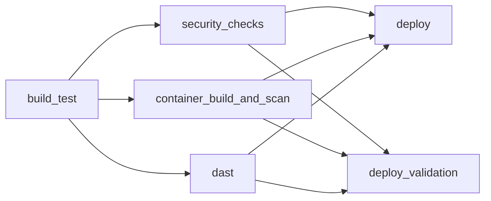

# Senior DevSecOps/AppSec Hardening Portfolio: Sock Shop (OWASP Juice Shop Lineage)

## 1. Project title and executive summary
This repository demonstrates a senior-level DevSecOps/Application Security hardening engagement on an inherited open-source application. The focus is not to claim the underlying app is “fully secure” (it is intentionally vulnerable by design), but to show how to operationalize governance, gated CI/CD, security controls, deployment policy, and remediation discipline around a complex legacy codebase. The outcome is a GitHub-native delivery model with explicit risk handling, stronger deploy controls, and reproducible security evidence.

## 2. What this project demonstrates
- Inherited application security onboarding and triage.
- CI/CD rationalization from mixed legacy automation to one GitHub workflow model.
- Gated security automation across build, code, dependency, container, and runtime checks.
- Protected deploy governance tied to branch policy.
- Failure-driven remediation (pipeline failures treated as engineering inputs, not noise).
- Pipeline performance optimization without removing core security controls.
- Practical risk handling where inherited or demo behavior cannot be fully removed safely.

## 3. Before vs after
| Area | Original state | Problems found | Current improved state |
|---|---|---|---|
| CI platform | Mixed inherited automation patterns | Competing CI ownership and weak narrative | GitHub Actions-centered pipeline and archived legacy CI artifacts |
| Trigger model | Inconsistent branch/manual behavior over time | Missing/unclear execution on feature work and manual validation | Explicit push/PR/manual model with deploy/deploy_validation separation |
| Security signal handling | Some brittle steps (missing outputs, path assumptions) | False-negative pipeline failures and noisy diagnostics | Conditional artifact publishing and resilient reporting |
| Runtime consistency | Native module and Node-version mismatch incidents | Test failures and environment drift | Node 22 CI runtime, explicit rebuild path for native bindings, aligned version policy |
| Deploy controls | Branch-condition drift and rollout instability | Deploy skipped unexpectedly or validation failures | Protected deploy on `master`, manual feature-branch deploy validation, Kind/deploy fixes |
| Security governance | Tooling present but unevenly integrated | Tooling failures and policy ambiguity | Coherent gated chain with documented accepted-risk boundaries |

## 4. Pipeline architecture overview
Active workflow: `.github/workflows/devsecops-gated.yml`


```mermaid
flowchart LR
  A[build_test] --> B[security_checks]
  A --> C[container_build_and_scan]
  A --> D[dast]
  B --> E[deploy]
  C --> E
  D --> E
  B --> F[deploy_validation]
  C --> F
  D --> F
```

Stages and intent:
1. `build_test`: install, lint, build, server/API tests, startup smoke test.
2. `security_checks`: CodeQL, Semgrep, Gitleaks, Trivy FS scan, SBOM, signing-readiness artifacts.
3. `container_build_and_scan`: container build, image scan, Dockerfile/Kubernetes config checks.
4. `dast`: local app startup and OWASP ZAP baseline scan.
5. `deploy`: protected deployment path for `master` only.
6. `deploy_validation`: manual deploy test path for non-`master` branches.

Event behavior (verified from workflow + run history):
- `push` (all branches, with markdown/docs path ignore): runs `build_test`, `security_checks`, `container_build_and_scan`, `dast`; deploy jobs are condition-based.
- `pull_request` (with same path ignore): runs required validation jobs; `deploy` blocked.
- `workflow_dispatch`: runs pipeline manually; optional `run_deploy_validation=true` enables feature-branch deploy validation path.
- `master` only: protected `deploy` may run after all prerequisites pass and event is not PR.

## 5. Security controls implemented
- **CodeQL** (`github/codeql-action@v4`) for code scanning.
- **Semgrep** with baseline-aware behavior for PR and push contexts.
- **Gitleaks** for commit-range secret scanning.
- **Trivy**:
  - filesystem vulnerability scan,
  - container image vulnerability scan,
  - Dockerfile misconfiguration gate,
  - Kubernetes base-manifest misconfiguration gate.
- **SBOM generation** via Syft/CycloneDX.
- **Signing readiness** via Cosign installation + recorded keyless-signing guidance.
- **DAST** via OWASP ZAP baseline against repository-controlled app runtime.
- **Deploy gating** via explicit `needs` and branch/event conditions.
- **Artifact reuse** between jobs (build outputs and container image) for consistency and speed.
- **Branch protection assumptions (verified 2026-03-10)**:
  - required checks: `build_test`, `security_checks`, `container_build_and_scan`, `dast`,
  - 1 required approving review on `master`.

## 6. Major failures, fixes, and lessons learned
| Problem | Root cause | Remediation | Lesson learned |
|---|---|---|---|
| Missing lockfile CI failures | Pipeline expected lockfile behavior | Switched install strategy to match repo reality | CI must reflect repository contract |
| Native module failures (`libxmljs2`) | Script-skipping optimization prevented binding build | Restored script execution where runtime tests need native addons; explicit rebuild | Optimize safely, never at correctness expense |
| Trivy command failures | Invalid multi-target config invocation | Split scans by target with valid CLI usage | Security tooling requires exact operational correctness |
| SBOM write errors | Output directory not pre-created | Added explicit directory creation pre-step | Pipeline FS preconditions must be explicit |
| ZAP permission errors | Non-writable container work mount | Established writable report directory/mount strategy | DAST in CI needs explicit writable workspace design |
| SARIF upload failures | Unconditional upload of non-existent outputs | Added existence checks and conditional uploads | Reporting robustness is part of security engineering |
| Deploy skip due branch drift | Branch condition not aligned with actual policy | Explicitly aligned protected deploy to `master` | Branch-policy drift can silently disable release controls |
| Deploy validation rollout failures | Kind cluster-name mismatch + local overlay/runtime incompatibility | Explicit Kind cluster naming; local deploy compatibility patch; policy split between base gate and local overlay reporting | Separate hardening policy from local validation compatibility clearly |
| CodeQL action deprecation | Stale action major version | Upgraded to v4 family | Keep security dependencies lifecycle-managed |

Full details: `docs/remediation-log.md`

## 7. Validation evidence
Verified directly:
- Workflow behavior from completed runs:
  - `push` on feature branch: run `22882208517` succeeded; deploy jobs skipped as expected.
  - `pull_request`: run `22880716114` succeeded; deploy blocked as expected.
  - `workflow_dispatch` with deploy validation input: run `22873458723` succeeded; `deploy_validation` ran successfully.
  - `push` on `master`: run `22881386491` succeeded; protected `deploy` executed successfully.
- Branch protection queried via GitHub API on 2026-03-10 (`master` required checks and review).
- Workflow syntax validated with `actionlint` in this project lifecycle.

Unverified in this specific pass:
- Fresh local clean-machine validation for all test commands in this exact pass was not re-run.

## 8. How to run locally
Supported runtime for local development/CI baseline: **Node 22** (`.nvmrc` present).

Native Linux/WSL:
```bash
nvm install 22
nvm use 22
npm install --prefer-offline --no-audit --progress=false
npm start
```

Verification:
```bash
curl -fsS http://127.0.0.1:3000/rest/admin/application-version
npm run lint
npm run test:server
npm run test:api
```

Docker path:
```bash
docker build -t juice-shop:local .
docker run --rm -p 3000:3000 juice-shop:local
curl -fsS http://127.0.0.1:3000/rest/admin/application-version
```

## 9. How to adapt this for an organization
Use this repository as a control-framework template, not as a production app baseline.

1. Replace demo app assumptions:
- Swap vulnerable/demo workloads with internal services.
- Remove challenge/demo-specific accepted risks and align to enterprise policies.

2. Keep the gated model:
- Preserve a clear stage chain (`build/test` -> `security` -> `container` -> `DAST` -> `deploy`).
- Keep deploy blocked unless all required controls pass.

3. Formalize branch protection:
- Require status checks and reviewer policy on the protected branch.
- Enable strict up-to-date checks before merge for stronger change integrity.

4. Define risk acceptance governance:
- Introduce documented exception records with owner, expiry date, and compensating controls.
- Make exception scope precise (file/rule/environment), never broad suppression.

5. Calibrate severity and policy thresholds:
- Define what fails PRs vs what creates follow-up work by severity and exploitability.
- Version and review these thresholds as policy artifacts.

6. Improve DAST and deployment realism:
- Use controlled preview environments per PR when feasible.
- Require explicit production approvals and environment protections.

7. Move from portfolio to enterprise quality:
- Add signed artifact verification in deploy stage,
- Add runtime detection/telemetry and incident response hooks,
- Add policy-as-code controls for deployment/security standards.

See `docs/adoption-guide.md` for detailed implementation guidance.

## 10. Remaining caveats / accepted risks
- The inherited application itself remains intentionally vulnerable; this repo demonstrates controls around it, not full app hardening.
- Some dependency risk/deprecation posture is inherited upstream.
- Local deploy overlay includes compatibility adjustments for startup behavior; security gates remain stricter on base manifests.
- Docs/markdown-only path ignores reduce pipeline cost but intentionally skip expensive checks on docs-only changes.
- Branch protection is good but not maximal: `strict` up-to-date merge requirement is currently disabled.

## 11. Why this is senior-level work
This project demonstrates senior-level ownership because it combines architecture, governance, and execution: inheriting a messy baseline, designing a coherent control framework, debugging failures across build/security/deploy layers, preserving delivery velocity, and documenting tradeoffs honestly. It presents a realistic security engineering story: strong gated DevSecOps/AppSec controls around an inherited intentionally vulnerable application, not a misleading “fully secure app” claim.
