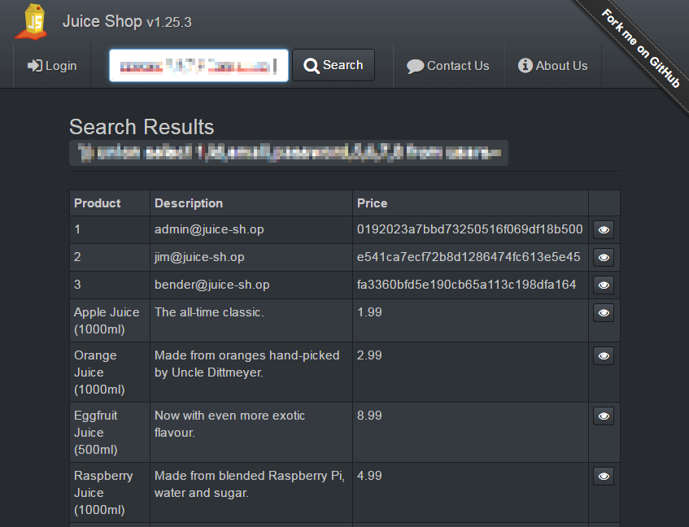
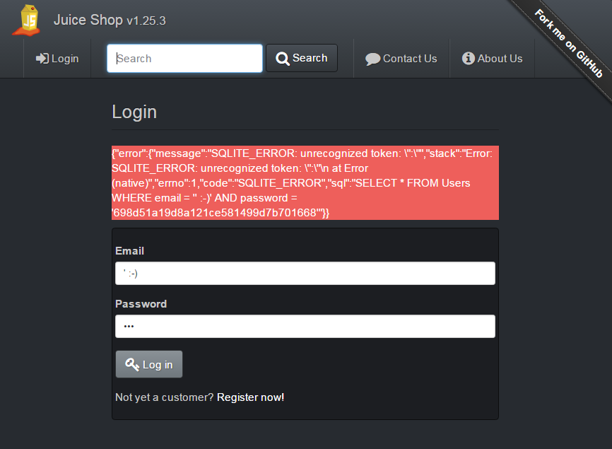
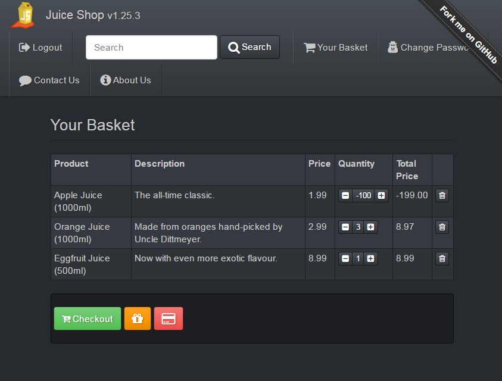
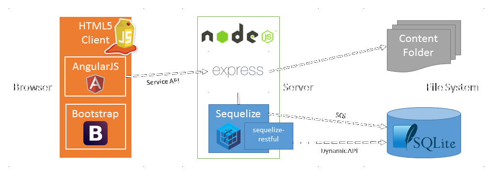
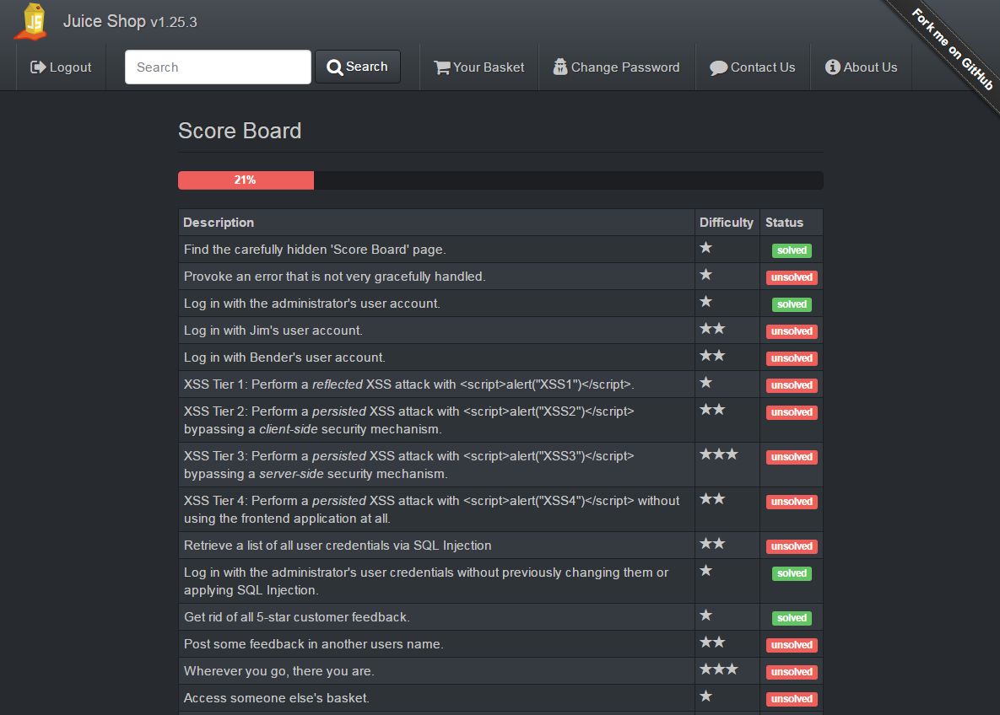

Juice Shop - Der kleine Saftladen für Sicherheitstrainings
==========================================================

Auf den ersten Blick sieht der _Juice Shop_ aus, wie ein kleiner, unscheinbarer Online-Shop für Fruchtsäfte und andere Artikel - inklusive Benutzerregistrierung, Artikelsuche, Rabattcoupons und Feebackfunktion. Bei genauerer Betrachtung, fällt jedoch auf, dass viele dieser Funktionen schwerwiegende Sicherheitslücken aufweisen. Da werden plötzlich Bestellungen mit negativem Gesamtpreis möglich, die Artikelsuche liefert statt O-Saft nun alle Kundendaten (samt verschlüsselter Passwörter) zurück und man kommt an Bereiche der Anwendung heran, auf die ein normaler Kunde eigentlich keinen Zugriff haben sollte. Was für ein sprichwörtlicher Saftladen!

  

Zur Ehrenrettung: Der _Juice Shop_ ist absichtlich so unsicher, denn er wurde von mir als [Open Source-Projekt](https://github.com/bkimminich/juice-shop) entwickelt, um Softwarentwicklern, -testern, Web-Admins aber auch IT-Managern die geläufigsten Schwachstellen von Webanwendungen vorzuführen oder sie in "Hack-it-yourself"-Sessions selbst ausprobieren zu lassen! Dieser Artikel stellt den _Juice Shop_ kurz vor und motiviert Sie hoffentlich, ihn für einen eigenen Hacking-Ausflug oder ein entsprechendes Event mit Ihren Entwicklerteams zu verwenden.

Die Architektur
---------------

Der _Juice Shop_ wurde komplett in Javascript entwickelt. Zum Einsatz kommen [AngularJS](https://angularjs.org) für das Single-Page-Application Frontend sowie [Express](http://expressjs.com) aufgesetzt auf [NodeJS](https://nodejs.org) für das RESTful Backend. Die Datenhaltung erfolgt in einer simplen dateibasierten [SQLite](https://www.sqlite.org) mit [Sequelize](http://sequelizejs.com) als objekt-relationales Mapping-Framework. Ein Teil der REST-API wird dynamisch (und ziemlich unsicher was Autorisierung angeht) von [sequelize-restful](https://github.com/sequelize/sequelize-restful) generiert.

Die Shop-Funktionalität ist Frontend- und API-seitig komplett mit Unit Tests auf Basis von [Jasmine](http://jasmine.github.io), [Karma](http://karma-runner.github.io) und [Frisby.js](http://frisbyjs.com) abgedeckt. Diese stellen sicher, dass der Shop für alle freundlich gesonnenen Saft-Kunden tatsächlich funktioniert. Nun sind diese Kunden jedoch nicht die eigentliche Zielgruppe des _Juice Shop_. Daher testen die deutlich umfangreicheren Ende-zu-Ende Tests auch weniger die Funktionalität, sondern vielmehr die Unsicherheit der Anwendung. Jeder dieser - mit Hilfe von [Protractor](https://angular.github.io/protractor) implementierten - Tests prüft eine der aktuell 28 absichtlichen Schwachstellen auf Ausnutzbarkeit. Bei Interesse finden Sie detailliertere Informationen zu diesem ungewöhnlichen Test-Szenario in meinem Gast-Beitrag [Proving that an application is as broken as intended](http://sauceio.com/index.php/2015/06/guest-post-proving-that-an-application-is-as-broken-as-intended) auf dem offiziellen [Sauce Labs Blog](http://sauceio.com).

Die Schwachstellen
------------------

Die Schwachstellen und Sicherheitslücken des _Juice Shop_ sind vielfältiger Natur. Zunächst wären da natürlich "Klassiker" aus der bekannten [OWASP Top 10-Liste](https://www.owasp.org/index.php/Category:OWASP_Top_Ten_Project):

1.	Mittels [SQL Injection](https://de.wikipedia.org/wiki/SQL-Injection) lassen sich die Benutzeranmeldung austricksen und sensitive Informationen direkt aus beliebigen Tabellen der Datenbank abgreifen.
2.	Die Authentifizierung und die Session-Verwaltung bestehen aus lausig selbst programmierten Sicherheitsfunktionen sowie völlig unsicher eingesetzten Standards.
3.	[Cross-Site Scripting (XSS)](https://de.wikipedia.org/wiki/Cross-Site-Scripting) ermöglicht das sofortige oder verzögerte Ausführen beliebigen schädlichen Javascripts im Kontext der Anwendung.
4.	Datenobjekte und auch Dateien werden direkt von der Anwendung referenziert, ohne dass eine solide Berechtigungsprüfung erfolgen würde, was einem unkontrollierten Vollzugriff auf alle Anwendungsdaten gleichkommt.
5.	Eingesetzte kryptografische Funktionen (wie z.B. bei den Rabatt-Coupons) werden hoffnungslos falsch verwendet oder sind unsicher konfiguriert.
6.	Die Anwendung posaunt sensitive Informationen völlig arglos in die Welt hinaus, z.B. in Form von technischen Fehlermeldungen oder dem Ablegen von geheimen Dokumenten in ungeschützten Bereichen der Applikation.
7.	Statt kritische Bereiche, wie den Administrations-Dialog, vernünftig gegen unerlaubten Zugriff abzusichern, verlässt sich der _Juice Shop_ auf ein klassisches [Security by Obscurity](https://de.wikipedia.org/wiki/Security_through_obscurity)-Antipattern: Verstecken statt schützen!
8.	Der Shop ist anfällig gegen die gefährliche [Cross-Site Request Forgery (CSRF)](https://de.wikipedia.org/wiki/Cross-Site-Request-Forgery)-Attacke, welche einen Angreifer unbemerkt im Hintergrund das Passwort jedes angemeldeten Benutzers ändern lässt, der sich versehentlich auf einen entsprechend präparierten Feedback-Eintrag oder ein untergejubeltes Produkt begibt.
9.	Etliche der eingesetzten Javascript-Module im _Juice Shop_ sind veraltet, bekanntermaßen unsicher oder mit Versionsnummern von 0.0.x schlichtweg noch nicht produktionsreif.
10.	Eine auf den ersten Blick gut abgesicherte Funktion zum Weiterleiten auf externe URLs entpuppt sich bei näherer Betrachtung als leicht zu umgehen, was die Umleitung auf Malware-Webseiten erlauben würde.

Darüber hinaus gibt es noch einiges mehr zu entdecken, zum Beispiel:

* einige Lücken in der Ablauflogik des Bestellprozesses
* ein eigentlich längst nicht mehr erhältliches Weihnachts-Sonderangebot
* ein alternatives Layout [wie zu hässlichsten GeoCities-Zeiten](http://oneterabyteofkilobyteage.tumblr.com/)
* zwei sogenannte [Easter Eggs](https://de.wikipedia.org/wiki/Easter_Egg) der Entwickler - eines davon dank [three.js](http://threejs.org) sogar in 3D!

Damit der angehende Hacker den Überblick nicht verliert und für seine Erfolge – ganz im Sinne von [Gamification](https://de.wikipedia.org/wiki/Gamification) - belohnt wird, gibt es im _Juice Shop_ eine Punkteübersicht, welche alle Schwachstellen auflistet und mitverfolgt, ob diese bereits erfolgreich ausgenutzt werden konnten. Diese Punkteübersicht im Shop überhaupt zu entdecken, ist übrigens bereits eine (einfache) der 28 Herausforderungen. Die übrigen Schwachstellen bilden vom Schwierigkeitsgrad eine große Bandbreite ab. Es gibt Sicherheitslücken, die sich direkt und einfach auszunutzen lassen, und solche, bei denen erst eine mehrstufige Recherche innerhalb und außerhalb der Anwendung Erfolg verspricht. Bei meinen bisherigen Security-Training und Hacking-Events mit dem _Juice Shop_ hatten sowohl Anfänger als auch gestandene Security-Profis stets genug zu tun und Frustration bzw. Unterforderung kamen selten auf.

Hack-it-yourself
----------------

Wenn Sie Lust bekommen haben, sich einmal selbst als Hacker einer Webanwendung zu versuchen, installieren Sie sich den _Juice Shop_ einfach auf Ihrem Rechner. In der [Installationsanleitung](https://github.com/bkimminich/juice-shop#setup) finden Sie alle nötigen Informationen, um die Anwendung lokal auf NodeJS oder [als Docker-Container](https://registry.hub.docker.com/u/bkimminich/juice-shop) zum Laufen zu bekommen. _Juice Shop_ läuft gleichermaßen auf Windows, Linux und MacOS. Wer ihn lieber in der Amazon-Cloud deployen möchte, findet auch entsprechende Installationstipps. Von großflächigen „Brute Force“ oder „Denial of Service“-Angriffen gegen eine AWS-Instanz rate ich jedoch dringend ab, da sich Amazon als Provider ggf. angegriffen fühlen könnte. Für solche Hacks beschränken Sie sich am besten auf eine lokal laufende Instanz des _Juice Shop_.

Sollten Sie Unterstützung bei der Installation benötigen oder einen (nicht absichtlich eingebauten) Fehler in der Anwendung finden, helfe ich gerne. Bei nicht in den [FAQ](https://github.com/bkimminich/juice-shop#troubleshooting-) aufgelisteten Problemen nutzen Sie gerne den [offiziellen Chat](https://gitter.im/bkimminich/juice-shop) oder melden Bugs gern auch direkt als [GitHub Issue](https://github.com/bkimminich/juice-shop/issues).

Gratis Laptop-Sticker für Kontributionen
----------------------------------------

Wenn Sie den _Juice Shop_ ihrerseits bei der Weiterentwicklung oder Fehlerbehebung unterstützen möchten: Es gibt immer etwas zu tun! Schauen Sie gerne bei GitHub nach [offenen Issues](https://github.com/bkimminich/juice-shop/issues?q=is%3Aissue+is%3Aopen), besonders gerne nach welchen mit dem [„help wanted“-Label](https://github.com/bkimminich/juice-shop/issues?q=is%3Aissue+is%3Aopen+label%3A%22help+wanted%22). Für Pull Requests aber auch gute Ideen zur Verbesserung, neuen Herausforderungen usw. winkt ein [gratis Satz offizieller _Juice Shop_ Laptop-Sticker](https://www.stickermule.com/de/user/1070702817/Sticker)! Per Post, egal von wo auf diesem Planeten Sie eine Kontribution beisteuern! Wenn jemand sich berufen fühlt, den _Juice Shop_ auf Angular2 zu migrieren, würde ich sogar eine [_Juice Shop_-Tasse](https://shop.spreadshirt.de/juiceshop/juice+shop+tasse-A104700368) drauf legen! ;-)

In diesem Sinne, viel Spaß beim Shoppen im ["most trustworthy online shop out there"](https://twitter.com/dschadow/status/706781693504589824)! Das Teilen von Screenshots Ihrer Hacking-Erfolge (bitte ohne Spoiler) mit dem Hashtag _\#juiceshop_ ist explizit erlaubt! ;-)
