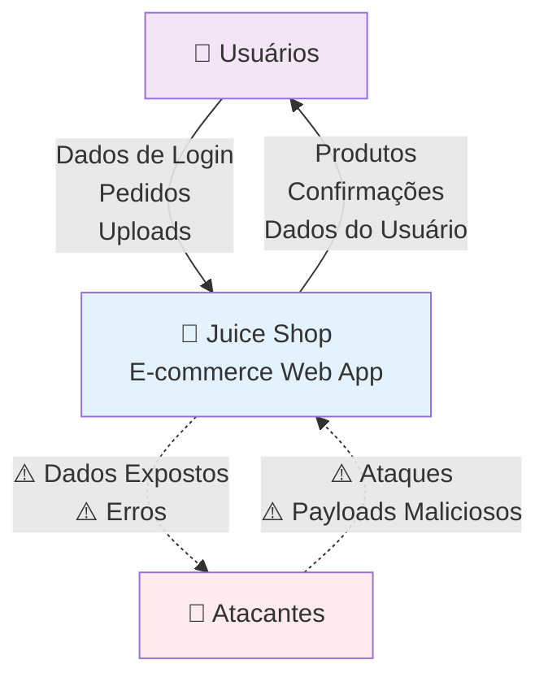
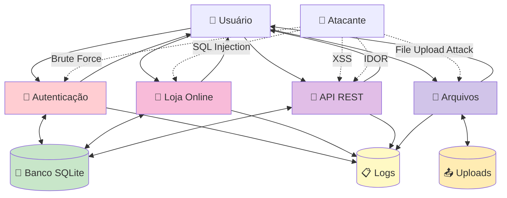
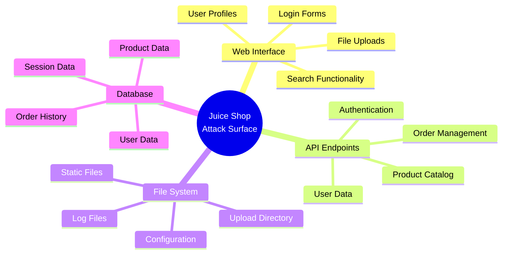

# Diagrama de Fluxo de Dados Simplificado - Juice Shop

## Para Apresentações em Aula de Segurança

Este é um diagrama simplificado do DFD do Juice Shop, otimizado para apresentações em sala de aula.

## DFD Nível 0 - Visão Geral do Sistema



## DFD Nível 1 - Componentes Principais



## Principais Vulnerabilidades por Componente

### 🔐 Autenticação

- **Vulnerabilidades**: Senhas fracas, JWT inseguro, bypass de auth
- **Impacto**: Acesso não autorizado, escalação de privilégios
- **OWASP Top 10**: A2 - Broken Authentication

### 🛒 Loja Online

- **Vulnerabilidades**: SQL Injection, IDOR, manipulação de preços
- **Impacto**: Acesso a dados, modificação de pedidos
- **OWASP Top 10**: A1 - Injection, A5 - Broken Access Control

### 🔌 API REST

- **Vulnerabilidades**: XSS, CSRF, exposição de dados
- **Impacto**: Roubo de sessão, execução de código
- **OWASP Top 10**: A7 - XSS, A3 - Sensitive Data Exposure

### 📁 Manipulação de Arquivos

- **Vulnerabilidades**: Upload malicioso, path traversal
- **Impacto**: Execução de código, acesso a arquivos
- **OWASP Top 10**: A6 - Security Misconfiguration

## Superfície de Ataque



## Cenários de Ataque Comuns

### 1. 🎯 SQL Injection no Search

```txt
Entrada: ' UNION SELECT email, password FROM Users--
Resultado: Exposição de credenciais de todos os usuários
```

### 2. 🎯 XSS na Busca de Produtos

```txt
Entrada: <script>alert('XSS')</script>
Resultado: Execução de JavaScript no browser
```

### 3. 🎯 Bypass de Autenticação

```txt
Entrada: admin@juice-sh.op'--
Resultado: Login como administrador sem senha
```

### 4. 🎯 Upload de Arquivo Malicioso

```txt
Arquivo: shell.php (disfarçado como imagem)
Resultado: Execução de código no servidor
```

### 5. 🎯 IDOR (Insecure Direct Object Reference)

```txt
URL: /api/Orders/1 (modificar ID para ver pedidos de outros)
Resultado: Acesso a dados de outros usuários
```

## Controles de Segurança Recomendados

### 🛡️ Prevenção

- **Input Validation**: Validar todas as entradas
- **Prepared Statements**: Usar queries parametrizadas
- **Output Encoding**: Codificar saídas para prevenir XSS
- **Access Control**: Implementar verificações adequadas
- **File Upload Security**: Validar tipos e conteúdo

### 🔍 Detecção

- **WAF**: Web Application Firewall
- **Logging**: Logs detalhados de segurança
- **Monitoring**: Monitoramento em tempo real
- **SIEM**: Security Information and Event Management

### 🚨 Resposta

- **Incident Response**: Plano de resposta a incidentes
- **Forensics**: Capacidade de análise forense
- **Recovery**: Planos de recuperação
- **Communication**: Comunicação com stakeholders

## Exercícios Práticos para Estudantes

### Nível Iniciante

1. Identificar campos de entrada vulneráveis
2. Testar payloads básicos de XSS
3. Tentar bypass simples de autenticação

### Nível Intermediário

1. Explorar SQL Injection com UNION
2. Realizar ataques IDOR
3. Explorar vulnerabilidades de upload

### Nível Avançado

1. Combinar múltiplas vulnerabilidades
2. Desenvolver exploits automatizados
3. Implementar controles de segurança

## Métricas de Segurança

### KPIs de Segurança

- Número de vulnerabilidades identificadas
- Tempo médio para correção
- Tentativas de ataque detectadas
- Taxa de falsos positivos

### Monitoramento

- Logs de tentativas de login falhadas
- Padrões anômalos de acesso
- Uploads de arquivos suspeitos
- Consultas SQL maliciosas

---

**📚 Objetivo Educacional**: Este material foi desenvolvido para ensinar conceitos de segurança de aplicações web através de exemplos práticos usando o OWASP Juice Shop como laboratório de aprendizado.
