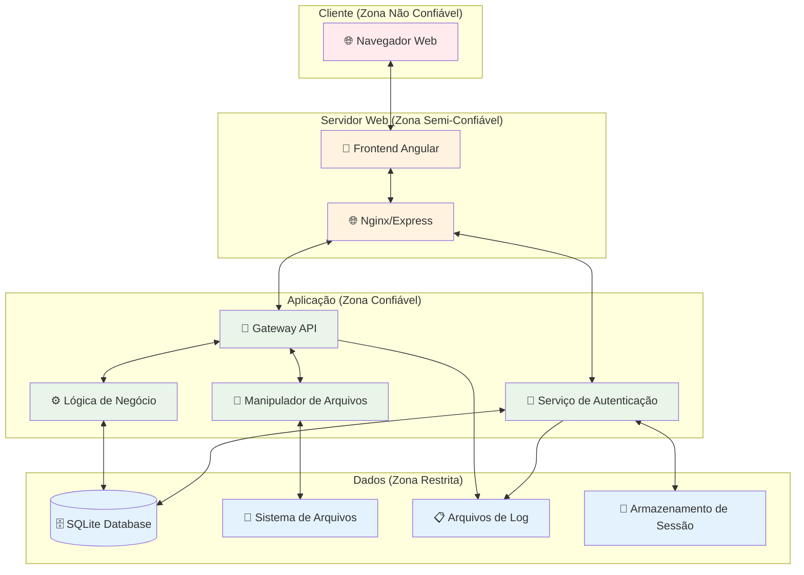

# Análise STRIDE - OWASP Juice Shop

## Modelagem de Ameaças usando Metodologia STRIDE

Este documento aplica a metodologia STRIDE (Spoofing, Tampering, Repudiation, Information Disclosure, Denial of Service, Elevation of Privilege) ao OWASP Juice Shop para identificação sistemática de ameaças.

## Arquitetura do Sistema

## Análise STRIDE por Componente

### 1. Serviço de Autenticação 🔐

| Ameaça                       | Descrição                                   | Probabilidade | Impacto | Risk Score | Mitigação                              |
| ---------------------------- | ------------------------------------------- | ------------- | ------- | ---------- | -------------------------------------- |
| **S** - Spoofing             | Bypass de autenticação usando SQL injection | Alta          | Alto    | 🔴 9       | Prepared statements, input validation  |
| **T** - Tampering            | Manipulação de tokens JWT                   | Média         | Alto    | 🟡 6       | Assinatura digital, validação de token |
| **R** - Repudiation          | Falta de logs de autenticação               | Baixa         | Médio   | 🟢 2       | Logging abrangente, audit trail        |
| **I** - Info Disclosure      | Exposição de dados de usuário               | Alta          | Alto    | 🔴 9       | Criptografia, access control           |
| **D** - DoS                  | Ataques de força bruta                      | Média         | Médio   | 🟡 4       | Rate limiting, account lockout         |
| **E** - Privilege Escalation | Escalação para admin                        | Alta          | Alto    | 🔴 9       | Role-based access control              |

### 2. Gateway API 🔌

| Ameaça                       | Descrição                   | Probabilidade | Impacto | Risk Score | Mitigação                            |
| ---------------------------- | --------------------------- | ------------- | ------- | ---------- | ------------------------------------ |
| **S** - Spoofing             | Falsificação de requisições | Média         | Médio   | 🟡 4       | Authentication tokens, CORS          |
| **T** - Tampering            | Injeção de código XSS       | Alta          | Alto    | 🔴 9       | Output encoding, CSP                 |
| **R** - Repudiation          | Falta de auditoria de API   | Baixa         | Baixo   | 🟢 1       | API logging, request tracking        |
| **I** - Info Disclosure      | Exposição de dados via API  | Alta          | Alto    | 🔴 9       | Authorization checks, data filtering |
| **D** - DoS                  | Sobrecarga de API           | Média         | Médio   | 🟡 4       | Rate limiting, throttling            |
| **E** - Privilege Escalation | Acesso a funções restritas  | Alta          | Alto    | 🔴 9       | Function-level access control        |

### 3. Lógica de Negócio ⚙️

| Ameaça                       | Descrição                  | Probabilidade | Impacto | Risk Score | Mitigação                           |
| ---------------------------- | -------------------------- | ------------- | ------- | ---------- | ----------------------------------- |
| **S** - Spoofing             | -                          | -             | -       | -          | N/A                                 |
| **T** - Tampering            | SQL injection em consultas | Alta          | Alto    | 🔴 9       | Parameterized queries, ORM          |
| **R** - Repudiation          | Transações sem auditoria   | Média         | Médio   | 🟡 4       | Transaction logging                 |
| **I** - Info Disclosure      | Vazamento via união SQL    | Alta          | Alto    | 🔴 9       | Query restrictions, least privilege |
| **D** - DoS                  | Consultas custosas         | Baixa         | Médio   | 🟢 2       | Query optimization, timeouts        |
| **E** - Privilege Escalation | IDOR em objetos            | Alta          | Alto    | 🔴 9       | Object-level authorization          |

### 4. Manipulador de Arquivos 📁

| Ameaça                       | Descrição                     | Probabilidade | Impacto | Risk Score | Mitigação                        |
| ---------------------------- | ----------------------------- | ------------- | ------- | ---------- | -------------------------------- |
| **S** - Spoofing             | -                             | -             | -       | -          | N/A                              |
| **T** - Tampering            | Upload de arquivos maliciosos | Alta          | Alto    | 🔴 9       | File type validation, sandboxing |
| **R** - Repudiation          | Uploads sem rastreamento      | Baixa         | Baixo   | 🟢 1       | Upload logging                   |
| **I** - Info Disclosure      | Acesso a arquivos sensíveis   | Média         | Alto    | 🟡 6       | Access controls, path validation |
| **D** - DoS                  | Upload de arquivos grandes    | Média         | Médio   | 🟡 4       | File size limits, quotas         |
| **E** - Privilege Escalation | Execução via upload           | Alta          | Alto    | 🔴 9       | File execution prevention        |

### 5. Banco de Dados 🗄️

| Ameaça                       | Descrição                   | Probabilidade | Impacto | Risk Score | Mitigação                           |
| ---------------------------- | --------------------------- | ------------- | ------- | ---------- | ----------------------------------- |
| **S** - Spoofing             | -                           | -             | -       | -          | N/A                                 |
| **T** - Tampering            | Modificação direta de dados | Baixa         | Alto    | 🟡 5       | Database access controls            |
| **R** - Repudiation          | Alterações sem auditoria    | Média         | Médio   | 🟡 4       | Database audit logs                 |
| **I** - Info Disclosure      | Acesso não autorizado       | Média         | Alto    | 🟡 6       | Encryption at rest, access controls |
| **D** - DoS                  | Sobrecarga do banco         | Baixa         | Alto    | 🟡 5       | Connection pooling, monitoring      |
| **E** - Privilege Escalation | Escalação via DB            | Baixa         | Alto    | 🟡 5       | Least privilege principle           |

### 6. Sistema de Arquivos 📂

| Ameaça                       | Descrição                    | Probabilidade | Impacto | Risk Score | Mitigação                    |
| ---------------------------- | ---------------------------- | ------------- | ------- | ---------- | ---------------------------- |
| **S** - Spoofing             | -                            | -             | -       | -          | N/A                          |
| **T** - Tampering            | Modificação de arquivos      | Média         | Alto    | 🟡 6       | File integrity monitoring    |
| **R** - Repudiation          | Alterações sem rastro        | Baixa         | Baixo   | 🟢 1       | File system auditing         |
| **I** - Info Disclosure      | Directory traversal          | Alta          | Médio   | 🟡 6       | Path sanitization            |
| **D** - DoS                  | Esgotamento de espaço        | Baixa         | Médio   | 🟢 2       | Disk quotas, monitoring      |
| **E** - Privilege Escalation | Acesso a arquivos do sistema | Média         | Alto    | 🟡 6       | File permissions, sandboxing |

### 7. Armazenamento de Sessão 🔄

| Ameaça                       | Descrição                    | Probabilidade | Impacto | Risk Score | Mitigação                |
| ---------------------------- | ---------------------------- | ------------- | ------- | ---------- | ------------------------ |
| **S** - Spoofing             | Session hijacking            | Média         | Alto    | 🟡 6       | Secure session tokens    |
| **T** - Tampering            | Manipulação de sessão        | Média         | Médio   | 🟡 4       | Session integrity checks |
| **R** - Repudiation          | Ações sem rastreamento       | Baixa         | Baixo   | 🟢 1       | Session activity logs    |
| **I** - Info Disclosure      | Exposição de dados de sessão | Média         | Médio   | 🟡 4       | Session encryption       |
| **D** - DoS                  | Session exhaustion           | Baixa         | Médio   | 🟢 2       | Session limits, cleanup  |
| **E** - Privilege Escalation | Session fixation             | Média         | Alto    | 🟡 6       | Session regeneration     |

## Mapeamento para OWASP Top 10

### A1 - Injection

- **Componentes Afetados**: Lógica de Negócio, Banco de Dados
- **STRIDE**: Tampering, Information Disclosure, Elevation of Privilege
- **Vulnerabilidades**: SQL Injection, NoSQL Injection, Command Injection

### A2 - Broken Authentication

- **Componentes Afetados**: Serviço de Autenticação, Armazenamento de Sessão
- **STRIDE**: Spoofing, Tampering, Elevation of Privilege
- **Vulnerabilidades**: Weak passwords, Session management, Brute force

### A3 - Sensitive Data Exposure

- **Componentes Afetados**: Todos os componentes
- **STRIDE**: Information Disclosure
- **Vulnerabilidades**: Unencrypted data, Weak crypto, Data leakage

### A4 - XML External Entities (XXE)

- **Componentes Afetados**: Gateway API, Manipulador de Arquivos
- **STRIDE**: Tampering, Information Disclosure, Denial of Service
- **Vulnerabilidades**: XML parsing, File disclosure, SSRF

### A5 - Broken Access Control

- **Componentes Afetados**: Gateway API, Lógica de Negócio
- **STRIDE**: Elevation of Privilege, Information Disclosure
- **Vulnerabilidades**: IDOR, Missing function level access control

### A6 - Security Misconfiguration

- **Componentes Afetados**: Todos os componentes
- **STRIDE**: Information Disclosure, Denial of Service
- **Vulnerabilidades**: Default configs, Unnecessary features, Verbose errors

### A7 - Cross-Site Scripting (XSS)

- **Componentes Afetados**: Gateway API, Frontend
- **STRIDE**: Tampering, Information Disclosure
- **Vulnerabilidades**: Reflected XSS, Stored XSS, DOM XSS

### A8 - Insecure Deserialization

- **Componentes Afetados**: Gateway API, Lógica de Negócio
- **STRIDE**: Tampering, Elevation of Privilege
- **Vulnerabilidades**: Remote code execution, Privilege escalation

### A9 - Using Components with Known Vulnerabilities

- **Componentes Afetados**: Todos os componentes
- **STRIDE**: Vários, dependendo da vulnerabilidade
- **Vulnerabilidades**: Outdated libraries, Vulnerable dependencies

### A10 - Insufficient Logging & Monitoring

- **Componentes Afetados**: Arquivos de Log, Monitoramento
- **STRIDE**: Repudiation
- **Vulnerabilidades**: Inadequate logging, Missing monitoring

## Matriz de Risco Consolidada

| Categoria               | Alto Risco (7-9)                                 | Médio Risco (4-6)                                          | Baixo Risco (1-3) |
| ----------------------- | ------------------------------------------------ | ---------------------------------------------------------- | ----------------- |
| **Autenticação**        | Spoofing, Info Disclosure, Privilege Escalation  | Tampering, DoS                                             | Repudiation       |
| **API Gateway**         | Tampering, Info Disclosure, Privilege Escalation | Spoofing, DoS                                              | Repudiation       |
| **Lógica de Negócio**   | Tampering, Info Disclosure, Privilege Escalation | Repudiation                                                | DoS               |
| **Arquivos**            | Tampering, Privilege Escalation                  | Info Disclosure, DoS                                       | Repudiation       |
| **Banco de Dados**      | -                                                | Tampering, Info Disclosure, DoS, Privilege Escalation      | Repudiation       |
| **Sistema de Arquivos** | -                                                | Tampering, Info Disclosure, Privilege Escalation           | Repudiation, DoS  |
| **Sessões**             | -                                                | Spoofing, Tampering, Info Disclosure, Privilege Escalation | Repudiation, DoS  |

## Plano de Mitigação Prioritário

### Prioridade 1 (Crítica) - Riscos 8-9

1. **SQL Injection Prevention**

   - Implementar prepared statements
   - Validação rigorosa de entrada
   - Least privilege database access

2. **Authentication Bypass Prevention**

   - Multi-factor authentication
   - Strong password policies
   - Session management security

3. **XSS Prevention**
   - Output encoding
   - Content Security Policy
   - Input sanitization

### Prioridade 2 (Alta) - Riscos 6-7

1. **File Upload Security**

   - File type validation
   - Virus scanning
   - Isolated file storage

2. **Access Control**
   - Role-based access control
   - Function-level authorization
   - Object-level authorization

### Prioridade 3 (Média) - Riscos 4-5

1. **Denial of Service Prevention**

   - Rate limiting
   - Resource quotas
   - Load balancing

2. **Session Security**
   - Secure session tokens
   - Session timeout
   - Session regeneration

### Prioridade 4 (Baixa) - Riscos 1-3

1. **Logging & Monitoring**
   - Comprehensive audit logs
   - Real-time monitoring
   - Incident response procedures

## Ferramentas Recomendadas

### Análise Estática

- **SAST**: SonarQube, Checkmarx, Veracode
- **Dependency Check**: OWASP Dependency Check, Snyk
- **Code Review**: Manual code review processes

### Análise Dinâmica

- **DAST**: OWASP ZAP, Burp Suite, Nessus
- **IAST**: Contrast Security, Seeker
- **Penetration Testing**: Manual testing, automated tools

### Monitoramento

- **WAF**: ModSecurity, Cloudflare, AWS WAF
- **SIEM**: Splunk, ELK Stack, IBM QRadar
- **Application Monitoring**: New Relic, Datadog, AppDynamics

---

**Nota**: Esta análise STRIDE foi desenvolvida para fins educacionais usando o OWASP Juice Shop como caso de estudo. As vulnerabilidades identificadas são intencionais e fazem parte do design da aplicação para treinamento em segurança.
