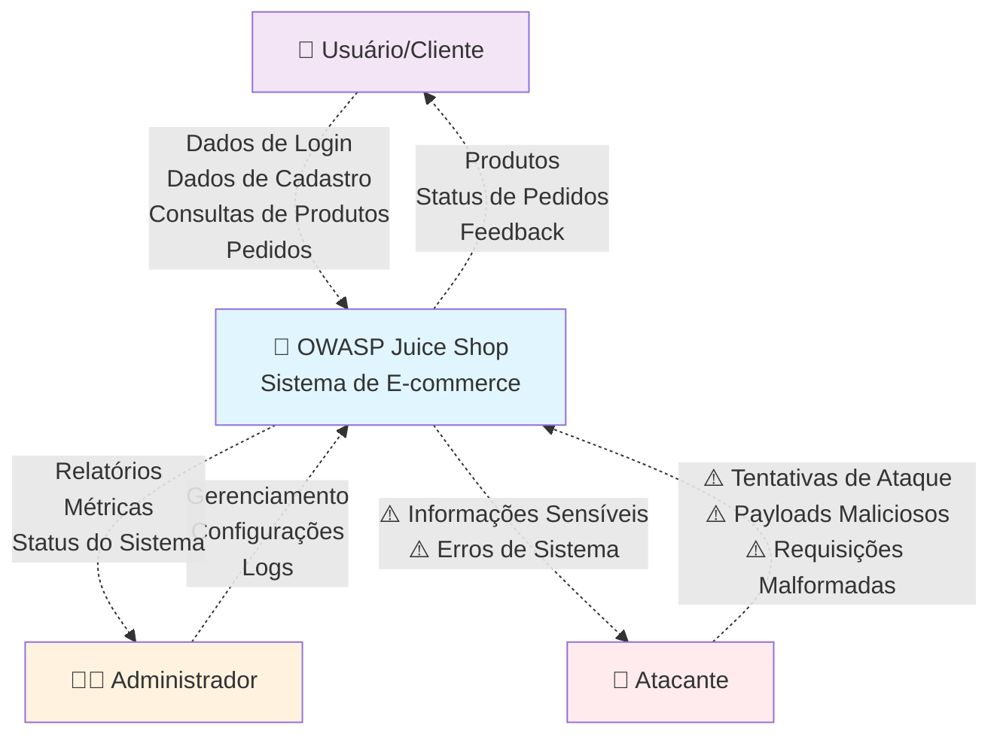
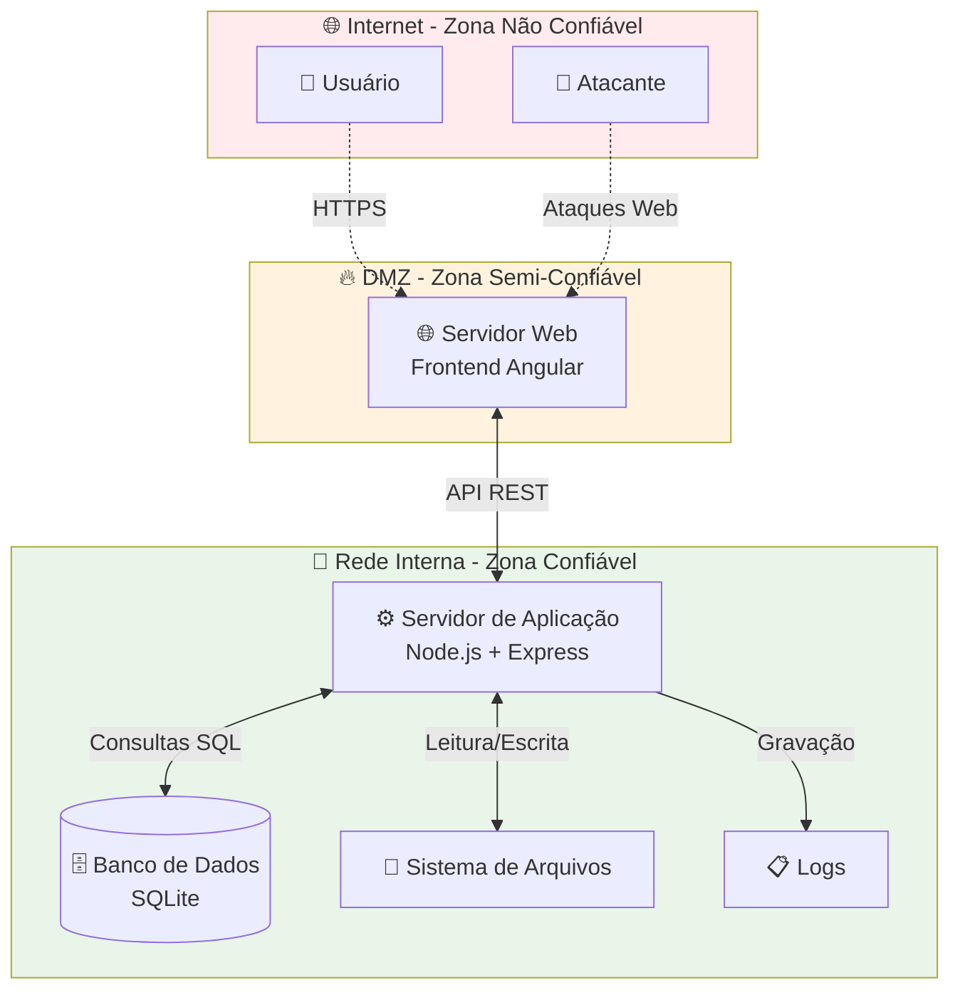

# Diagrama de Fluxo de Dados - OWASP Juice Shop

## Para Modelagem de Ameaças em Segurança no Desenvolvimento

Este documento contém o Diagrama de Fluxo de Dados (DFD) da aplicação OWASP Juice Shop, criado especificamente para fins educacionais em aulas de segurança no desenvolvimento, focando na modelagem de ameaças.

## Contexto da Aplicação

O OWASP Juice Shop é uma aplicação web voluntariamente vulnerável que simula uma loja online de sucos. A aplicação é construída usando:

- **Frontend**: Angular (TypeScript)
- **Backend**: Node.js com Express.js (TypeScript)
- **Banco de Dados**: SQLite com Sequelize ORM
- **Autenticação**: JWT (JSON Web Tokens)
- **Arquitetura**: SPA (Single Page Application) com API REST

## Diagrama de Fluxo de Dados (DFD) - Nível 0 (Contexto)

## Diagrama de Fluxo de Dados (DFD) - Nível 1 (Decomposição)

```mermaid
flowchart TD
    %% Entidades Externas
    Usuario[👤 Usuário]
    Admin[👨‍💼 Administrador]
    Atacante[🔴 Atacante]

    %% Processos Principais
    Auth[🔐 P1: Autenticação<br/>e Autorização]
    ProductMgmt[📦 P2: Gerenciamento<br/>de Produtos]
    OrderMgmt[🛒 P3: Gerenciamento<br/>de Pedidos]
    UserMgmt[👥 P4: Gerenciamento<br/>de Usuários]
    FileHandling[📁 P5: Manipulação<br/>de Arquivos]
    APIEndpoints[🔌 P6: API REST<br/>Endpoints]

    %% Armazenamentos de Dados
    UserDB[(D1: Usuários<br/>SQLite)]
    ProductDB[(D2: Produtos<br/>SQLite)]
    OrderDB[(D3: Pedidos<br/>SQLite)]
    LogFiles[(D4: Logs<br/>Arquivos)]
    UploadedFiles[(D5: Uploads<br/>Sistema de Arquivos)]
    SessionCache[(D6: Sessões<br/>Memória)]

    %% Fluxos do Usuário
    Usuario -->|"1. Credenciais"| Auth
    Auth -->|"2. Token JWT"| Usuario
    Auth <-->|"3. Validação"| UserDB
    Auth <-->|"4. Sessão"| SessionCache

    Usuario -->|"5. Busca/Filtros"| ProductMgmt
    ProductMgmt -->|"6. Lista de Produtos"| Usuario
    ProductMgmt <-->|"7. Consultas"| ProductDB

    Usuario -->|"8. Dados do Pedido"| OrderMgmt
    OrderMgmt -->|"9. Confirmação"| Usuario
    OrderMgmt <-->|"10. Persistência"| OrderDB
    OrderMgmt <-->|"11. Validação de Estoque"| ProductDB

    Usuario -->|"12. Upload de Arquivos"| FileHandling
    FileHandling -->|"13. URL do Arquivo"| Usuario
    FileHandling <-->|"14. Armazenamento"| UploadedFiles

    Usuario -->|"15. Requisições API"| APIEndpoints
    APIEndpoints -->|"16. Respostas JSON"| Usuario

    %% Fluxos do Administrador
    Admin -->|"17. Login Admin"| Auth
    Admin -->|"18. Gestão de Produtos"| ProductMgmt
    Admin -->|"19. Relatórios"| UserMgmt
    UserMgmt <-->|"20. Dados de Usuários"| UserDB
    Admin <-->|"21. Visualização de Logs"| LogFiles

    %% Fluxos do Atacante (Ameaças)
    Atacante -.->|"⚠️ SQL Injection"| ProductMgmt
    Atacante -.->|"⚠️ XSS Payloads"| APIEndpoints
    Atacante -.->|"⚠️ Auth Bypass"| Auth
    Atacante -.->|"⚠️ File Upload Attacks"| FileHandling
    Atacante -.->|"⚠️ IDOR Attacks"| OrderMgmt
    Atacante -.->|"⚠️ Brute Force"| Auth

    %% Logs gerados por todos os processos
    Auth -->|"22. Logs de Autenticação"| LogFiles
    ProductMgmt -->|"23. Logs de Acesso"| LogFiles
    OrderMgmt -->|"24. Logs de Transações"| LogFiles
    FileHandling -->|"25. Logs de Upload"| LogFiles
    APIEndpoints -->|"26. Logs de API"| LogFiles

    %% Estilos
    style Auth fill:#ffcdd2
    style ProductMgmt fill:#f8bbd9
    style OrderMgmt fill:#e1bee7
    style UserMgmt fill:#d1c4e9
    style FileHandling fill:#c5cae9
    style APIEndpoints fill:#bbdefb

    style UserDB fill:#c8e6c9
    style ProductDB fill:#dcedc8
    style OrderDB fill:#f0f4c3
    style LogFiles fill:#fff9c4
    style UploadedFiles fill:#ffecb3
    style SessionCache fill:#ffe0b2

    style Usuario fill:#f3e5f5
    style Admin fill:#fff3e0
    style Atacante fill:#ffebee
```

## Principais Ameaças Identificadas por Processo

### P1: Autenticação e Autorização

- **Ameaças STRIDE**:
  - **S** (Spoofing): Bypass de autenticação, uso de tokens forjados
  - **T** (Tampering): Manipulação de tokens JWT
  - **R** (Repudiation): Falta de logs adequados de autenticação
  - **I** (Information Disclosure): Exposição de informações de usuários
  - **D** (Denial of Service): Ataques de força bruta
  - **E** (Elevation of Privilege): Escalação de privilégios para admin

### P2: Gerenciamento de Produtos

- **Ameaças STRIDE**:
  - **S** (Spoofing): -
  - **T** (Tampering): SQL Injection em consultas de produtos
  - **R** (Repudiation): -
  - **I** (Information Disclosure): Union-based SQL Injection
  - **D** (Denial of Service): Consultas malformadas causando timeout
  - **E** (Elevation of Privilege): Acesso a dados restritos via SQL Injection

### P3: Gerenciamento de Pedidos

- **Ameaças STRIDE**:
  - **S** (Spoofing): -
  - **T** (Tampering): Manipulação de preços, IDOR em pedidos
  - **R** (Repudiation): Falta de auditoria em alterações de pedidos
  - **I** (Information Disclosure): Acesso a pedidos de outros usuários
  - **D** (Denial of Service): -
  - **E** (Elevation of Privilege): Acesso a funcionalidades de admin

### P4: Gerenciamento de Usuários

- **Ameaças STRIDE**:
  - **S** (Spoofing): Criação de contas administrativas
  - **T** (Tampering): Alteração de perfis de outros usuários
  - **R** (Repudiation): -
  - **I** (Information Disclosure): Exposição de dados pessoais
  - **D** (Denial of Service): -
  - **E** (Elevation of Privilege): Alteração de roles de usuários

### P5: Manipulação de Arquivos

- **Ameaças STRIDE**:
  - **S** (Spoofing): -
  - **T** (Tampering): Upload de arquivos maliciosos
  - **R** (Repudiation): -
  - **I** (Information Disclosure): Acesso a arquivos sensíveis
  - **D** (Denial of Service): Upload de arquivos grandes
  - **E** (Elevation of Privilege): Execução de código via upload

### P6: API REST Endpoints

- **Ameaças STRIDE**:
  - **S** (Spoofing): -
  - **T** (Tampering): XSS, CSRF, manipulação de parâmetros
  - **R** (Repudiation): -
  - **I** (Information Disclosure): Exposição de dados via API
  - **D** (Denial of Service): Rate limiting inadequado
  - **E** (Elevation of Privilege): Bypass de controles de acesso

## Armazenamentos de Dados e Ameaças

### D1-D3: Bancos de Dados SQLite

- **Ameaças**:
  - SQL Injection
  - Acesso direto ao arquivo de banco
  - Backup inadequado
  - Criptografia ausente

### D4: Arquivos de Log

- **Ameaças**:
  - Acesso não autorizado
  - Log injection
  - Exposição de informações sensíveis
  - Falta de rotação de logs

### D5: Sistema de Arquivos (Uploads)

- **Ameaças**:
  - Upload de malware
  - Path traversal
  - Execução de código
  - Directory listing

### D6: Cache de Sessões (Memória)

- **Ameaças**:
  - Session hijacking
  - Session fixation
  - Falta de timeout adequado
  - Dados sensíveis em memória

## Fronteiras de Confiança

## Principais Vulnerabilidades do Juice Shop (Para Fins Educacionais)

1. **Injection**

   - SQL Injection (União, Boolean-based, Error-based)
   - NoSQL Injection
   - Command Injection
   - LDAP Injection

2. **Broken Authentication**

   - Weak passwords
   - JWT vulnerabilities
   - Session management flaws
   - Brute force attacks

3. **Sensitive Data Exposure**

   - Unencrypted data transmission
   - Weak cryptographic storage
   - Information disclosure through errors

4. **XML External Entities (XXE)**

   - XML parsing vulnerabilities
   - File disclosure
   - SSRF through XXE

5. **Broken Access Control**

   - IDOR (Insecure Direct Object References)
   - Missing function level access control
   - CORS misconfiguration

6. **Security Misconfiguration**

   - Directory listing
   - Verbose error messages
   - Unnecessary features enabled

7. **Cross-Site Scripting (XSS)**

   - Reflected XSS
   - Stored XSS
   - DOM-based XSS

8. **Insecure Deserialization**

   - Remote code execution
   - Privilege escalation

9. **Using Components with Known Vulnerabilities**

   - Outdated libraries
   - Vulnerable dependencies

10. **Insufficient Logging & Monitoring**
    - Inadequate audit logs
    - Missing real-time monitoring

## Como Usar Este DFD para Modelagem de Ameaças

### 1. Identificação de Ativos

- Dados de usuários (PII)
- Informações de pagamento
- Sessões de usuário
- Código-fonte e configurações
- Logs do sistema

### 2. Análise STRIDE por Componente

Para cada processo e armazenamento de dados, aplique a metodologia STRIDE:

- **S**poofing Identity
- **T**ampering with Data
- **R**epudiation
- **I**nformation Disclosure
- **D**enial of Service
- **E**levation of Privilege

### 3. Classificação de Riscos

- **Alto**: Vulnerabilidades que permitem acesso completo ao sistema
- **Médio**: Vulnerabilidades que expõem dados sensíveis
- **Baixo**: Vulnerabilidades de divulgação de informações menor

### 4. Controles de Segurança Recomendados

- Validação de entrada rigorosa
- Autenticação multifator
- Controle de acesso baseado em função
- Criptografia de dados sensíveis
- Logging e monitoramento abrangentes
- Testes de segurança automatizados

## Referências

- [OWASP Top 10](https://owasp.org/www-project-top-ten/)
- [OWASP Juice Shop](https://owasp.org/www-project-juice-shop/)
- [Microsoft Threat Modeling](https://docs.microsoft.com/en-us/azure/security/develop/threat-modeling-tool)
- [STRIDE Methodology](https://docs.microsoft.com/en-us/azure/security/develop/threat-modeling-tool-threats)

---

**Nota Educacional**: Este DFD foi criado especificamente para fins educacionais. O OWASP Juice Shop é uma aplicação intencionalmente vulnerável e não deve ser usada em ambientes de produção.
