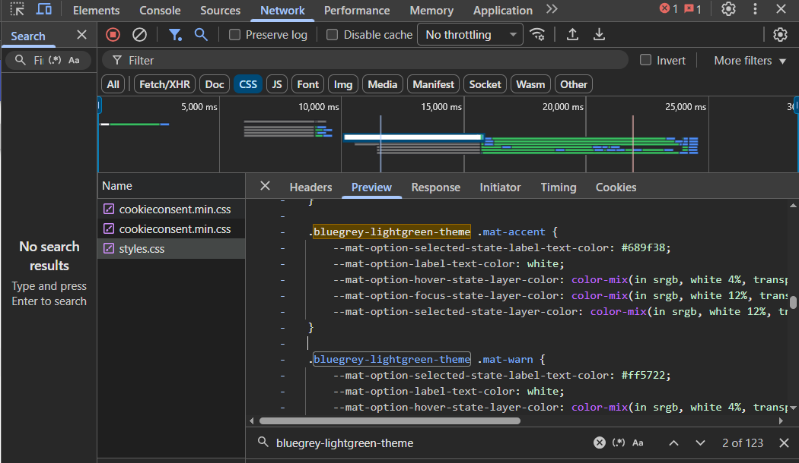
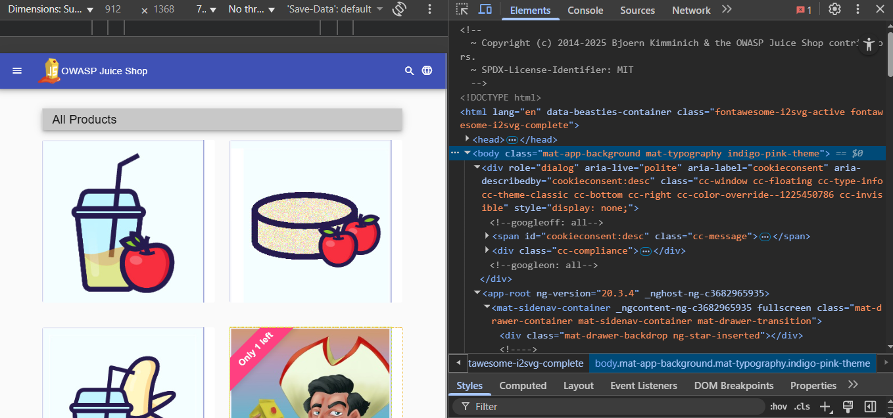
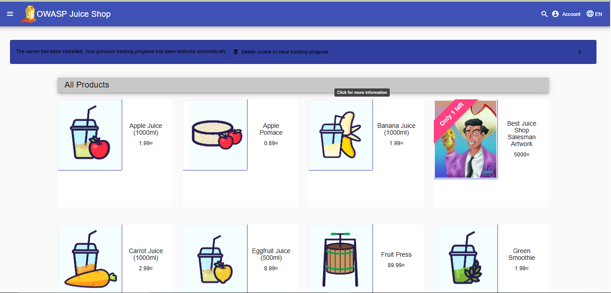

# 🎨 Theme Verification Guide (for Contributors)

OWASP Juice Shop uses Angular Material themes such as `deeppurple-amber`, `indigo-pink`, and others.  
This guide helps contributors verify that the correct theme CSS is loaded and applied during development.

---

## 🧩 1. Objective

The goal is to ensure that the selected theme from `config/default.yml` is:
- Correctly compiled during the frontend build process  
- Properly applied to the web interface  
- Loaded as the active stylesheet in the browser

---

## ⚙️ 2. Configuration

Open the configuration file:
```bash
config/default.yml
```

Locate the theme setting and update it:
```yaml
theme: bluegrey-lightgreen
```

Change it to your desired theme, for example:
```yaml
theme: indigo-pink
```

Save the file after editing.

## 🏗️ 3. Build and Start the Application

Run the following commands from the project root:

```bash
# Build the frontend
npm run build:frontend

# Start the application
npm start
```

Then open your browser and visit:
👉 http://localhost:3000


---

## 🔍 4. Verifying Theme in Browser

🧾 Step 1: Network Tab

1.Open Chrome DevTools → Network tab
2.Reload the page (Ctrl + R)
3.Filter by .css
4.Confirm that the loaded CSS file matches your selected theme name.

📸 Example:




🧱 Step 2: Elements Tab

1.Open Chrome DevTools → Elements tab
2.Inspect the <body> element
3.Confirm that it contains your theme class, for example:

```html
<body class="mat-app-background mat-typography bluegrey-lightgreen-theme">
```

📸 Example:




🏠 Step 3: Homepage Verification

Visually confirm that the color scheme of the homepage matches the selected theme.
For instance, buttons, headers, and input borders should reflect the active color palette.

📸 Example:



