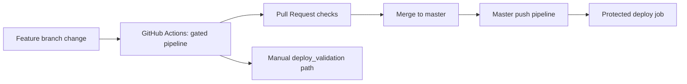
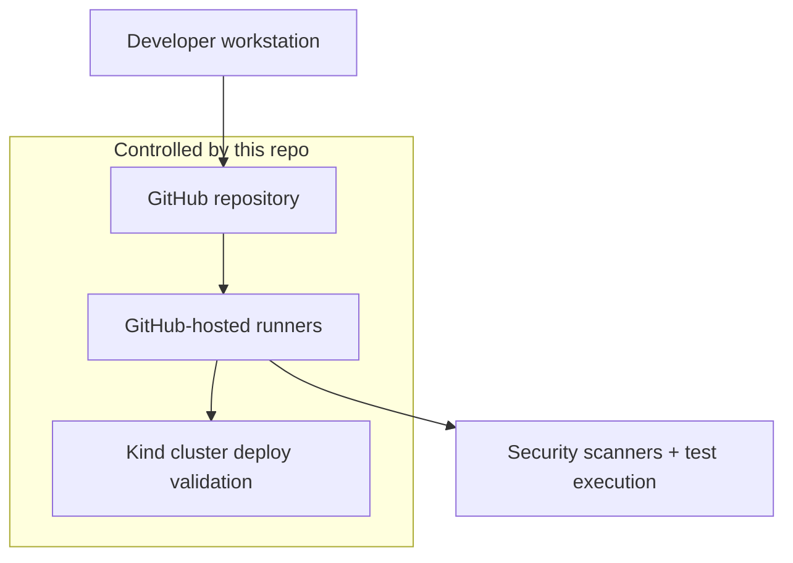

# Architecture Overview

## Scope
This repository contains an inherited Node/TypeScript web application with frontend assets and a security-focused GitHub Actions automation model.

## Runtime components
- Application server: Node.js (`build/app.js`) serving API and frontend assets.
- Data layer: SQLite (`data/juiceshop.sqlite`) and local data/content files.
- Container runtime: Docker image built from `Dockerfile`.
- Deployment validation/protected deploy target: ephemeral Kind Kubernetes cluster in CI.

## Delivery architecture

## Trust boundaries (high-level)

## Key design intent
- Keep security and quality controls before deployment paths.
- Separate protected deploy from feature-branch deploy validation.
- Preserve evidence artifacts for diagnostics and review.
- Use explicit risk boundaries where inherited app behavior conflicts with strict hardening.

## Inherited-app reality
The application lineage is intentionally vulnerable for security training. The architecture work here demonstrates process hardening, governance, and risk management around such a codebase.
