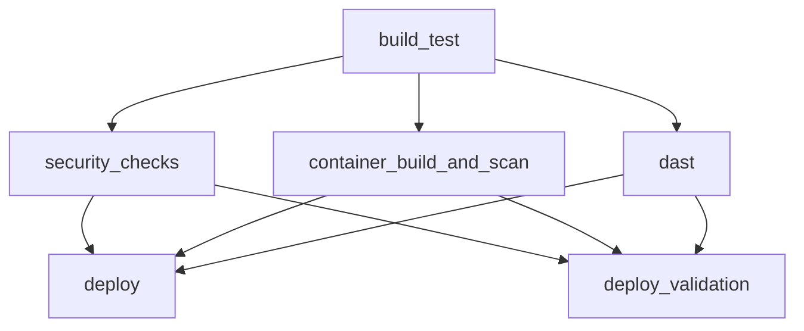

# Security Pipeline Overview

## Purpose
This document explains the active security pipeline implemented in `.github/workflows/devsecops-gated.yml`, how gates are enforced, and where accepted risk boundaries exist.

## Stage model

## Stage details
1. `build_test`
- Installs dependencies (Node 22 runtime in CI).
- Runs lint, server build, frontend build, server tests, API tests.
- Performs app startup smoke test.
- Publishes build artifacts/logs for downstream jobs.

2. `security_checks`
- CodeQL (`init/autobuild/analyze` v4).
- Semgrep with baseline-aware behavior.
- Gitleaks secret scan.
- Trivy filesystem vulnerability scan.
- SBOM generation (Syft/CycloneDX output).
- Cosign signing-readiness artifact.
- Enforces scan-gate outcomes.

3. `container_build_and_scan`
- Builds container image.
- Runs Trivy image vulnerability scan and uploads SARIF when present.
- Runs Trivy Dockerfile misconfiguration gate (blocking).
- Runs Trivy Kubernetes base misconfiguration gate (blocking).
- Runs local overlay misconfiguration scan (non-blocking reporting) for deploy-validation compatibility context.
- Exports image artifact for deploy jobs.

4. `dast`
- Starts the app in CI runner context.
- Waits for health readiness.
- Runs ZAP baseline with repository-managed rules (`.zap/rules.tsv`).
- Keeps meaningful findings blocking while classifying expected auth-endpoint detection (`10111`) as informational.
- Publishes DAST reports/logs as artifacts.

5. `deploy` (protected)
- Requires successful completion of `build_test`, `security_checks`, `container_build_and_scan`, and `dast`.
- Runs only on `refs/heads/master` and never on `pull_request` events.

6. `deploy_validation` (manual)
- Requires same gated prerequisites as `deploy`.
- Runs only on `workflow_dispatch` with `run_deploy_validation=true` on non-`master` branches.
- Provides a safe validation path before merge.

## Trigger behavior
- `push`: all branches (`**`) with `paths-ignore` for markdown/docs-only changes.
- `pull_request`: same `paths-ignore` behavior.
- `workflow_dispatch`: manual invocation with deploy-validation input.

## Evidence-backed behavior snapshot (verified)
- Feature-branch push: required checks run; deploy jobs skipped.
- Pull request: required checks run; deploy blocked.
- Manual dispatch with deploy-validation flag: deploy_validation runs.
- Master push: protected deploy runs.

## Gate integrity notes
- Deploy cannot run unless all required prerequisite jobs pass.
- Security jobs are not allowed to silently fail into deploy path.
- Artifact checks prevent pipeline breaks caused by missing optional outputs.

## Accepted risk boundaries
- Local Kubernetes overlay scan is non-blocking to support repository-controlled deploy-validation runtime compatibility.
- Base Kubernetes manifests remain blocking for high/critical misconfiguration findings.
- ZAP alert `10111` (Authentication Request Identified on `/rest/user/login`) is `INFO` in `.zap/rules.tsv`; this preserves visibility of auth surface while avoiding false gate failures for expected behavior.
- This repo secures the delivery process around an intentionally vulnerable inherited app; it does not claim the app itself is production-safe.
