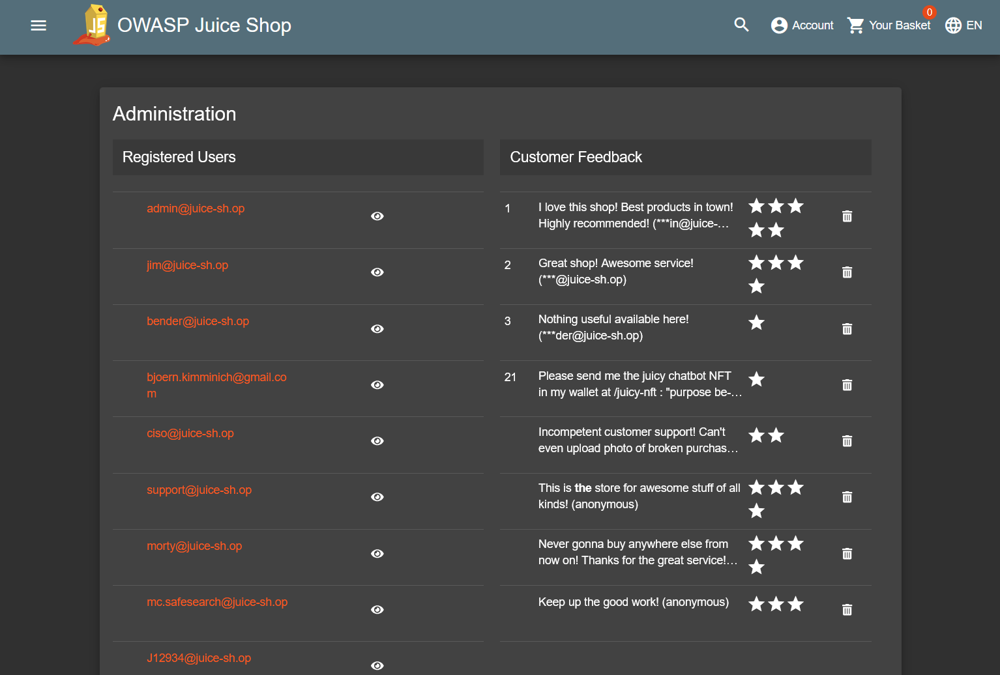
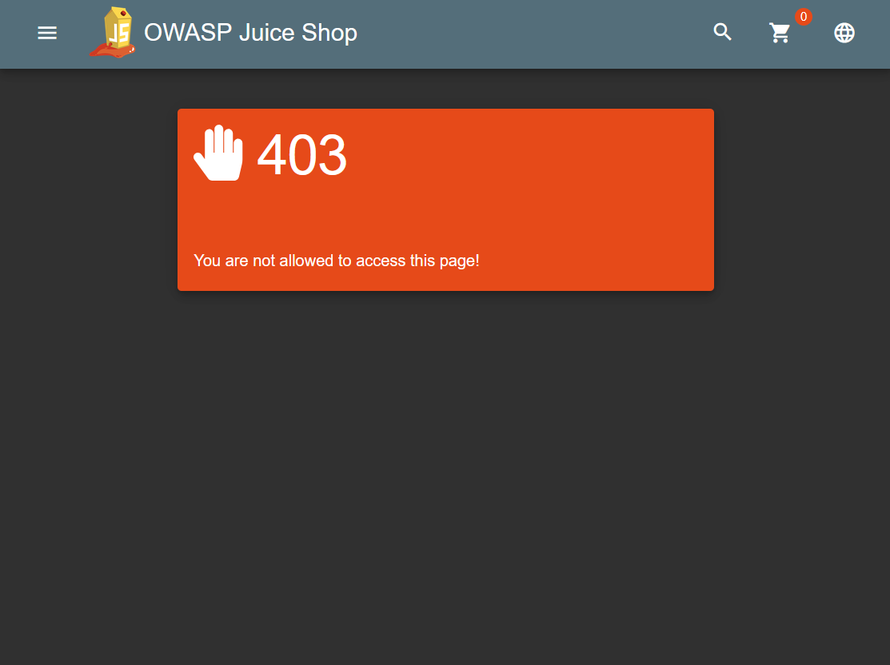

# Admin Route
## How to exploit

[Forge admin credentials](admin-registration.md), log in, and then navigate from the base site to `/#/administration`. You will see a list of every site user, and be able to delete customer feedback:

## Explanation
Juice Shop is plagued by poorly managed access control. This particular vulnerability concerns the site's administrative control panel, which is accessed via the public route `/administration`. 

The application uses RBAC (Role-Based Access Control), wherein access privileges are defined by a user's assigned role. Only users signed in to an account with the role `admin` may access to the control panel itself, but any user, even one without an account, may visit the administration URL. A non-admin who requests the route receives this page:

This configuration presents two risks:
1. Anyone can incidentally discover that the route exists, and that it hosts a restricted resource. Though an admin account is required to access these resources, the mere confirmation of their location gives potential attackers a clear target.

2. Anyone who manages to gain admin status can exercise admin privileges via a public-facing HTTP route. Since the only difference between a customer account and an admin account is the value of the account's `role` parameter, the barrier to this possibility is dangerously thin.

## Mitigation

In this case, we have mitigated the risk by removing the `/administration` route altogether. Attempting to visit the page has no effect, as with any other non-existent subdirectory of the site.

Given a proper administrative setup, the route has no legitimate reason to exist. Administrative utilities for the site can, and likely should, be hosted in a totally private system. How this would be managed depends on organizational needs, but customers and admins should NOT share a user system. 

The privileges of the admin page are limited to viewing users and deleting site reviews, both of which could be quite easily integrated into a simple, server-sequestered utility which queries the site's SQL database.