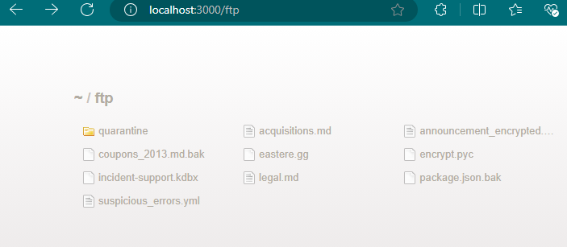
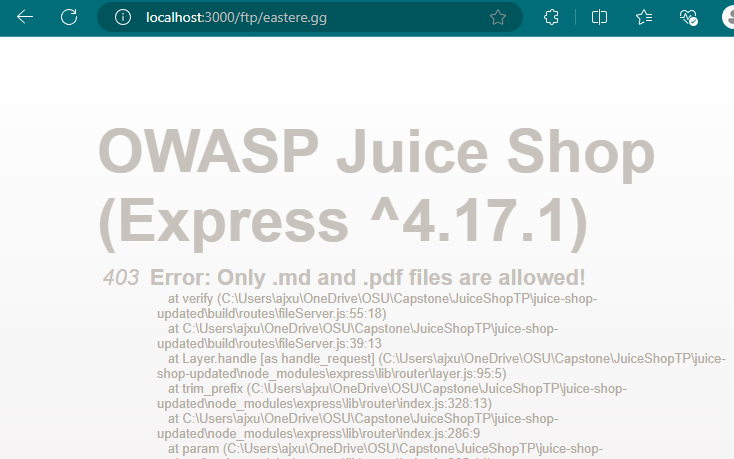
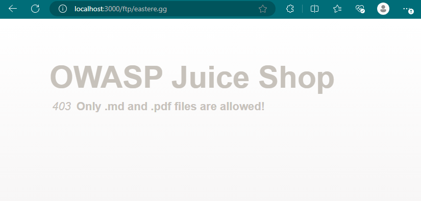

# Security Misconfiguration - Error Handling
## How To (Vulnerable Website)
1. Go to /FTP page of vulnerable website. 

2. Attempt to click any file that is not of MD or PDF file type.

3. Error message will reveal sensitive information about the web application framework and version. 

## How to (Secured Website)
1. Go to /FTP page of vulnerable website. 

2. Attempt to click any file that is not of MD or PDF file type.

3. Error message will only have the web application title, error status code, and error message. 

## Mitigations
Hide the sensitive information that is revealed by the error handler when reaching the error. 

## Root Cause
The existing code for the Juice Shop error handler title included the framework and framework version. The stack trace is also outputted by default. 

Authored by: Amy Xu