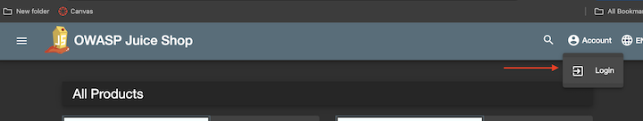
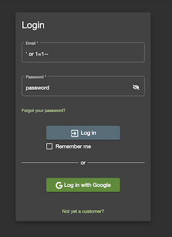
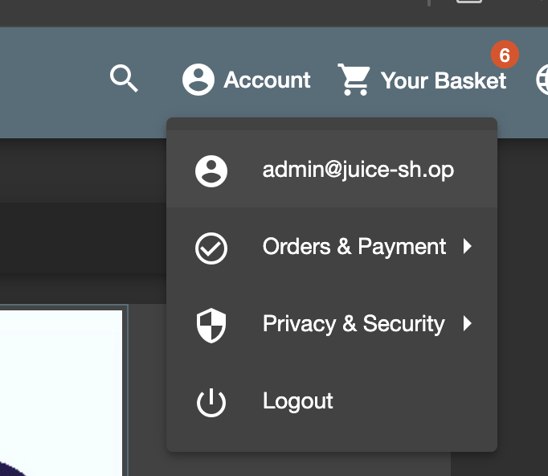
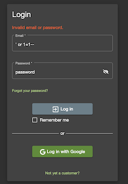

# SQL Injection - Login
Targets OWASP vulnerability [#3: Injection](https://owasp.org/Top10/A03_2021-Injection/)

## How To (Vulnerable Website)
1. Go to vulnerable website


2. Go to login page



3. Enter `' or 1=1--` for the email and `password` for the password



4. Click "login"
5. Verify access as admin by clicking on "Account" in the header and ensure logged in as "admin@juice-shop.op"



## How To (Secured Website)
1. Go to secured website
2. Go to login page


3. Enter `' or 1=1--` for the email and `password` for the password


4. Click "login"
5. Verify failed login:




## Mitigations
**Use of Prepared Statements:** Use prepared statements with parameterized queries to prevent SQL injection.
This technique is where the database pre-compiles SQL code and stores the results, separating it from data.

## Root cause
The root cause of the issue is that raw SQL is being used in the login api (routes/login.ts)
```
SELECT * FROM Users WHERE email = '${req.body.email || ''}' AND password = '${security.hash(req.body.password || '')}' 
AND deletedAt IS NULL`, { model: UserModel, plain: true })
```


Authored by: Elizabeth Mayer
