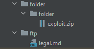
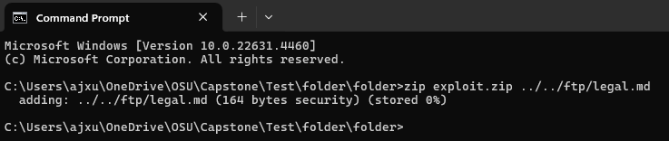
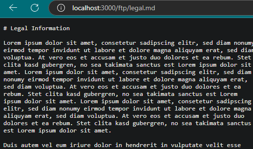

# Outdated and Vulnerable Components - Arbitrary File Write
## How To (Vulnerable Website)
1. Create and log into an account.

2. Navigate to the complaints page from the menu bar on the left side. (http://websitename/#/complain)

3. Create ZIP file with traversal paths. 
    3a. Create file structure similar to Juice Shop's FTP. 

    3b. Create legal.md file with any content desired in the FTP folder. 
    

    3c. Navigate to second 'folder' folder and use command line to create zip file. 
    

4. Upload exploit zip file into complaints page. 

5. Navigate to legal file in FTP (https://websitename/ftp/legal.md) to view contents have been changed. 

## How to (Secured Website)
1. Create and log into an account.

2. Navigate to the complaints page from the menu bar on the left side. (http://websitename/#/complain)

3. Create ZIP file with traversal paths. 
    3a. Create file structure similar to Juice Shop's FTP. 

    3b. Create legal.md file with any content desired in the FTP folder. 
    

    3c. Navigate to second 'folder' folder and use command line to create zip file. 
    

4. Upload exploit zip file into complaints page. 

5. Navigate to legal file in FTP (https://websitename/ftp/legal.md) to view contents remain the same. 

## Mitigations
Verify the files do not contain '..' and '/', to ensure they do not have traversal pathing. 

## Root Cause
Archives can contain files that have traversal paths, giving them the ability to be extracted in locations that may not normally be accessible. This is known as the Zip Slip vulnerability. 

Authored by: Amy Xu