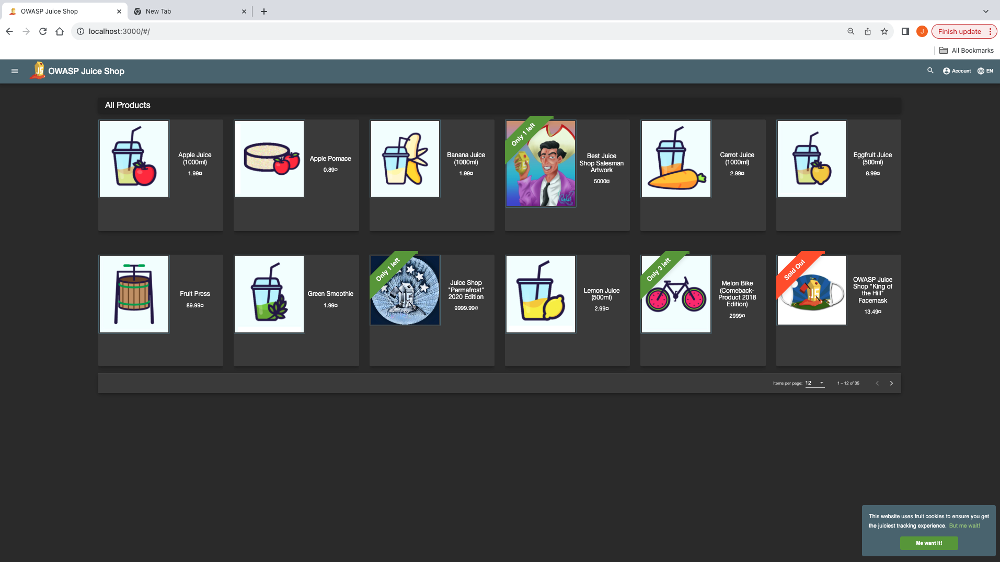

# OWASP Juice Shop Deployment

## Application
OWASP Juice Shop – intentionally vulnerable web application.

## Environment
- OS: macOS
- Docker Desktop
- Git
- Browser: Chrome

## Steps Followed
1. Forked the OWASP Juice Shop repository from GitHub.
2. Cloned the forked repository to my local machine using Git.
3. Installed and started Docker Desktop.
4. Pulled the OWASP Juice Shop Docker image:
   docker pull bkimminich/juice-shop
5. Ran the container exposing port 3000:
   docker run -d -p 3000:3000 bkimminich/juice-shop
6. Verified the container was running using:
   docker ps
7. Opened the application via http://localhost:3000.
8. Took a screenshot of the homepage and saved it in `screenshots/homepage.png`.

## Screenshot

## GitHub Questions

### 1. Is there anything wrong with committing directly to the master branch?
Yes!!!!! It bypasses basic reviews and testing processes, which can cause errors or security issues. For security purposes the tool would scan the PR for new vulnerabilities that are being introduced and potentially block depending to the decided policies. 

### 2. How would you prevent that?
- Configure branch protection in GitHub settings
- Require pull requests and approvals
- Have tools scanning the PRs

### 3. Repository Settings Changes
- Enabled branch protection rules on master
- Required pull requests before merging
- Required at least one reviewer
