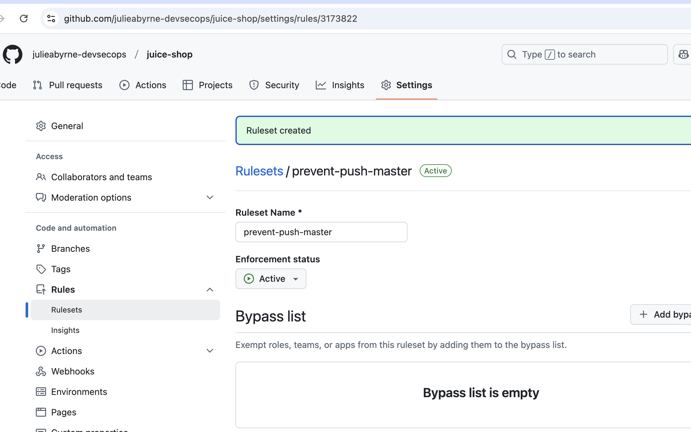
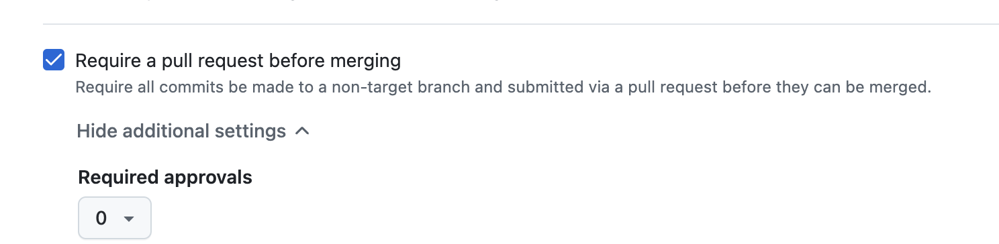

# Cycode CSM Assignment

## Warmup Questions and Answers

1. What is a CVE? 
  - Common vulnerabilities and exposures - vulnerabilities found and filed by organizations that are  CVE Numbering Authorities (CNA’s) and stored in the national vulnerability database (NVD)							

2. What is CVSS?
  - Common Vulnerability Scoring System - helps identify the severity of a CVE; the score is 0-10 with 10 being the most severe.  The score is provided by the vendor or NVD
 							
3. What is Log4Shell? How is log4j related to Log4Shell?

  - Log4Shell is the vulnerability found in the open source Apache logging library log4j that allowed for remote code execution on many software applications
 							
4. What is SBOM? Name a couple of standard formats available. What are the main differences between each format?
  - Software Bill of Materials - lists all of the open source libraries used by an application, including transitive dependencies.  CycloneDX 	and SPDX are the most common formats.  CycloneDX was designed specifically for software supply chain security, providing information about all of the components of the software application, while SPDX was originally created specifically for open source license identification and management for the software application components.  But both are widely used for SBOM generation today.						

5. What is OWASP Top 10? Choose one of the vulnerabilities included in the top 10 and give a short explanation.

 - OWASP is the Open Web Application Security Project and  the OWASP Top 10 are the most common categories of security issues with web applications.  A popular category is injection.  This involves data input by end users not being sanitized before being used in methods, allowing malicious actors to input commands such as a sql query to obtain sensitive information or even delete large data sets. 							

6. What is FOSS?

 - Free an open source software - code that is publicly available for software development organizations to use and contribute back to. 
 							
7. What is a package manager?
 - It’s a mechanism for securely publishing, managing, and consuming software libraries for a specific coding framework.  Different package managers used for Javascript (npm or yarn), Java (gradle or maven), Python (pypi), and ruby (bundler).  The source code repository typically contains a file that specifies what packages and versions are needed as dependencies to build an application, and the packages are pulled from the specified repository and install them.
 							
8. What is git, and what is the difference between git and GitHub?
 - Git is a distributed source code version control system that allows developers to collaborate on projects and version and control the flow of changes.  GitHub is the most popular implementation of git, with the hosted version used by most open source projects and also by many private companies.  GitHub offers other tools in addition to git as part of a platform for software development, including CI/CD capabilities with GitHub actions and issue management.  GitHub also offers a self-managed version that can be installed behind a customer’s firewall for more secure use by companies with strict compliance requirements.							

9. What is SDLC?
 - Software Development Lifecycle - all of the steps needed to work from an initial idea/feature request to the deployed production-ready feature.  
 							
10. What is Jenkins? How is it being utilized during the SDLC?
 - Jenkins is the most popular open source tool used for continuous build, test, and delivery of an application (CI/CD) 							

11. What is CSPM?
 - Cloud security posture management - the ability to understand all potential security threats for a cloud-based application and relationships between these threats in order to prioritize remediation efforts to maintain a secure application
 							
12. What is SAST? What is DAST? What are the main differences?
 - SAST is Static Application Security Testing and DAST is Dynamic Application Security Testing.  SASTS scans the source code to look for patterns that are known as common security weaknesses.  SAST is commonly used early in the SDLC to make developers aware of code that might introduce new vulnerabilities so it can be fixed prior to being pushed to production.  However, many SAST scanners produce many false positives where the specific code flagged is not actually insecure.  DAST, on the other hand, is Dynamic Application Security Testing - it runs against a running web application (in an ephemeral or test environment, not in production).  It crawls the web application to find every path through it - through buttons, forms, links, etc and then simulates real-world attacks  to try to gain access to sensitive data or bring down the web server.
 							
13. What is SLSA? What are the security levels?
 - Supply chain levels for software artifacts - it’s a set of policies and controls to ensure the security and authenticity of software artifacts across the software supply chain (build, test, and distribution).  There are 4 levels, 0 - 3, each with its own specifications.  Each level progressively builds on the previous levels to provide additional security controls

## OWASP Juice Shop Demo Set up
The [OWASP Juice Shop](https://owasp.org/www-project-juice-shop/#:~:text=OWASP%2520Juice%2520Shop%25) application was used for this assignment.

### Run the Application Locally as a Docker Container from a Newly Built Image

To run the containerized juice shop web application locally, you will need to install [Docker](https://www.docker.com/products/docker-desktop/).  If you install Docker Desktop, then Docker Scout will be automatically installed.  If you are using Docker Engine without Docker Desktop, follow the [instructions here](https://docs.docker.com/scout/install/) to install the Docker Scout binary.

Once you have installed Docker, perform the following steps in a terminal window:

1. Clone this repository

`git clone https://github.com/julieabyrne-devsecops/juice-shop.git`

2. Navigate to the repository root directory

`cd juice-shop`

3. Build the Docker image and push it to your DockerHub orgaanization (note: you must be logged into Docker to perform this operation)

`docker build --push -t <ORG_NAME>/juiceshop:v1 .`

4. To run the web application locally, run the command: 

`docker run --rm -p 127.0.0.1:3000:3000 <ORG_NAME>/juiceshop:v1`

The homepage will then be available at <http://localhost:3000>

## Locking Down the GitHub Repo
By default, GitHub allows code changes to be pushed directly to the default branch.  This is an insecure configuration, however, as it allows developers to forego code review of changes before they are integrated with production code.  To prevent the push to the default branch (master), use the repository settings to create a new ruleset to require that code changes can only be merged from a PR for a feature branch to the default branch.

The ruleset should contain this rule:

