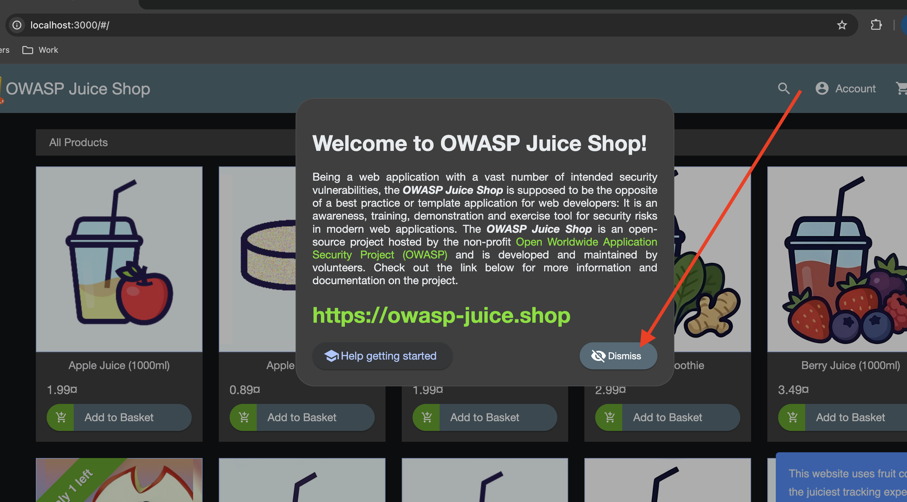
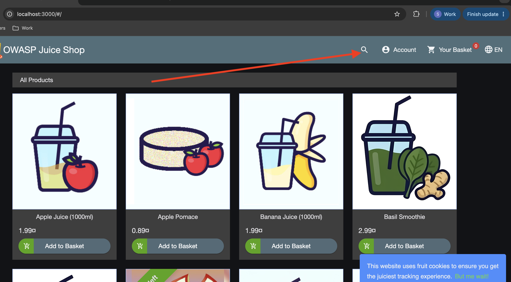
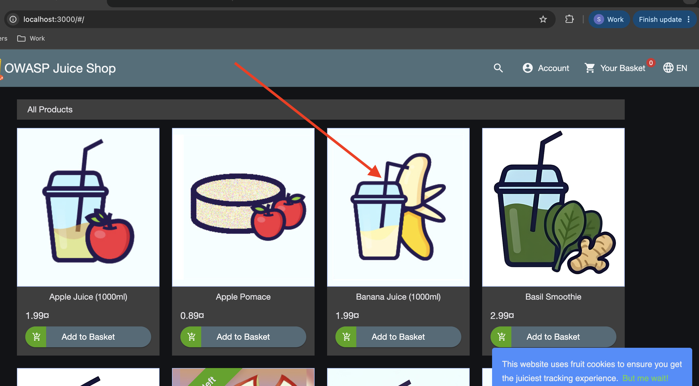
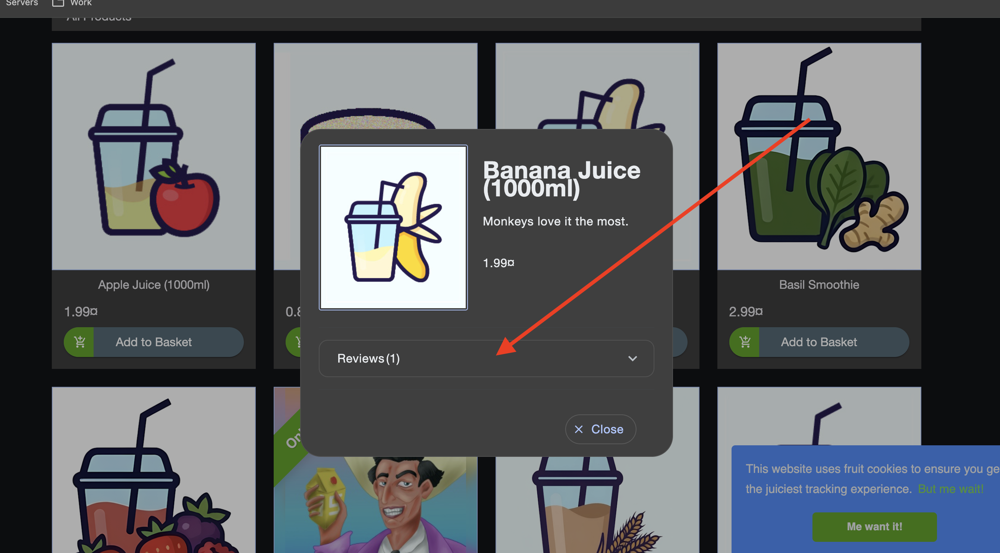
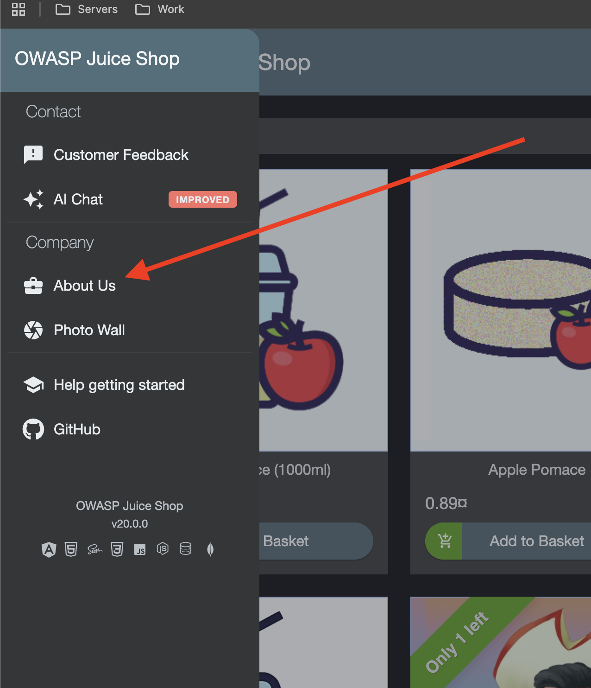

Use git to create your own branched named: ```<yourName>-homework-one```
Create the file homework-one.md in your name folder.
For each of the following, write up to 3 css selectors, and mark which one is the best to use and why.
When you're done, commit your changes, create a pull request, and request review from Sean.
Note: you can use https://www.w3schools.com/cssref/css_selectors.php and other resources to help you.

1. The dismiss button on the initial popup


2. The search button


3. Open product (banana)


4. Reviews button


5. About Us menu button


